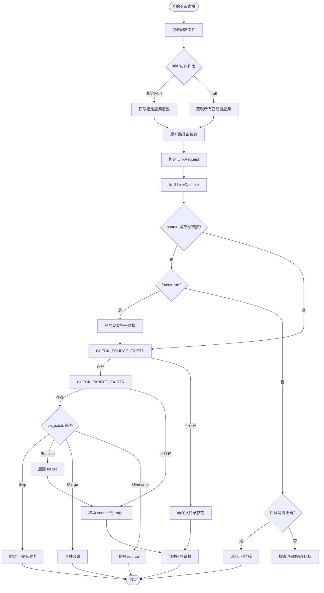
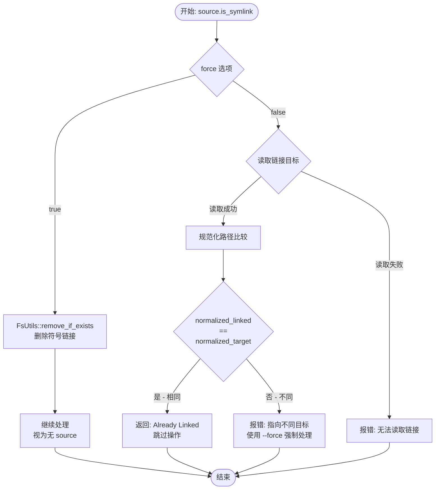
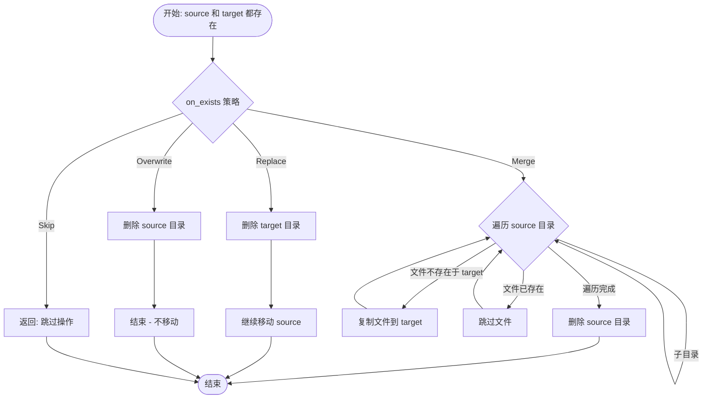
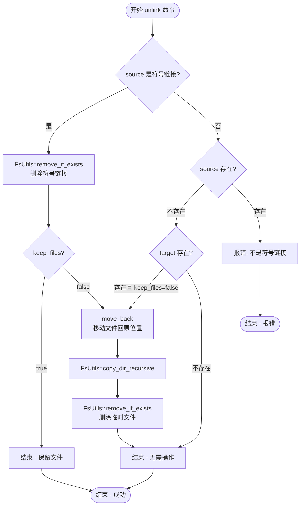
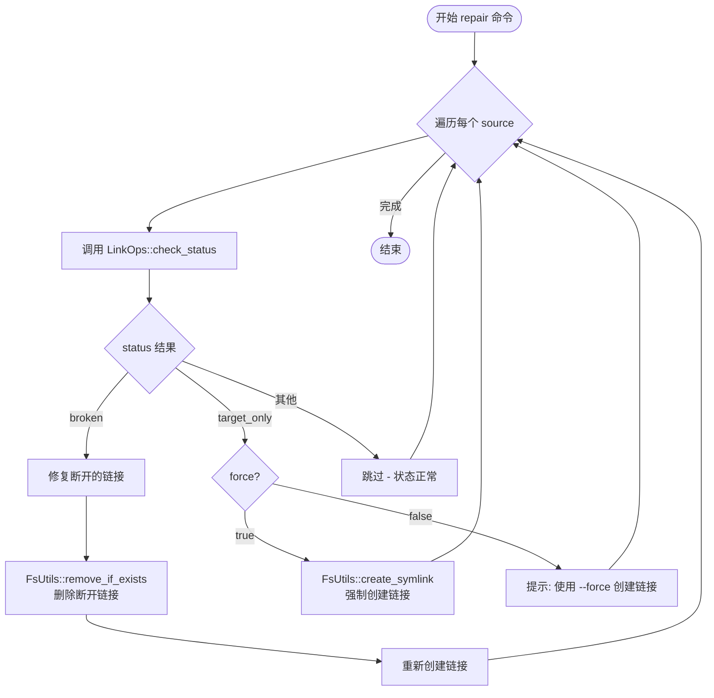
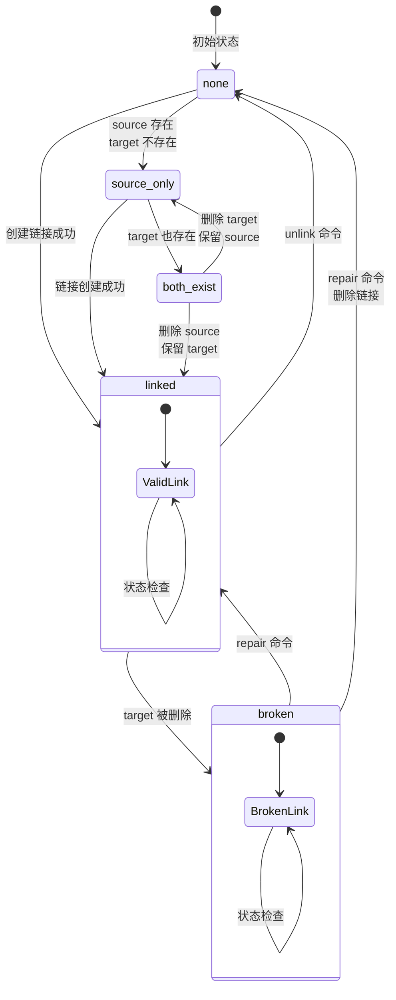

# link-disk 架构文档

## 1. 项目概述

**link-disk** 是一个 CLI 工具，用于将软件的配置和存储数据从默认位置（通常是 C 盘）转移到其他磁盘分区，通过创建硬链接或软链接的方式，既转移了物理存储，又不影响软件的正常使用。

### 核心价值

- 将文件夹转移到目标位置
- 创建硬链接或软链接回原位置
- 支持多应用、多文件夹的管理
- 通过配置文件灵活配置
- 完整的链接状态管理

---

## 2. 架构总览

### 2.1 分层架构

```
┌─────────────────────────────────────────────────────────────┐
│                         CLI 层                               │
│                   main.rs + cli.rs                           │
│              职责: 命令解析和业务协调                          │
└──────────────────────────┬──────────────────────────────────┘
                           │
┌──────────────────────────▼──────────────────────────────────┐
│                       Config 层                              │
│                       config.rs                               │
│              职责: TOML 配置解析和数据结构                      │
└──────────────────────────┬──────────────────────────────────┘
                           │
        ┌─────────────────┼─────────────────┐
        ▼                                   ▼
┌───────────────────┐             ┌───────────────────┐
│   Workspace 层     │             │  Path Resolver 层 │
│  workspace.rs      │             │ path_resolver.rs  │
│  职责: 工作区路径   │             │  职责: 占位符替换  │
│      管理          │             └───────────────────┘
└─────────┬─────────┘
          │
          │ 使用
          ▼
┌─────────────────────────────────────────────────────────────┐
│                      Link Ops 层                             │
│                       link_ops.rs                           │
│              职责: 链接操作业务逻辑编排                        │
└──────────────────────────┬──────────────────────────────────┘
                           │
                           │ 调用
                           ▼
┌─────────────────────────────────────────────────────────────┐
│                      FS Utils 层                            │
│                       fs_utils.rs                           │
│              职责: 文件系统原子操作封装                        │
└─────────────────────────────────────────────────────────────┘
```

### 2.2 模块依赖关系

```
main.rs
    ├── cli.rs          (依赖)
    ├── config.rs       (依赖)
    ├── workspace.rs    (依赖)
    ├── link_ops.rs     (依赖)
    │       └── fs_utils.rs
    ├── path_resolver.rs (依赖)
    └── fs_utils.rs     (无下层依赖)
```

---

## 3. 核心模块详解

### 3.1 CLI 层 (main.rs + cli.rs)

**文件位置:** `src/main.rs`, `src/cli.rs`

**职责:**
- 程序入口点
- 命令行参数解析 (clap)
- 业务逻辑协调

**关键类型:**

```rust
// cli.rs
struct Cli {
    command: Commands,
    config: Option<String>,
    verbose: bool,
}

enum Commands {
    Init { path: Option<String>, force: bool },
    Link { apps: Vec<String>, all: bool, dry_run: bool },
    Unlink { apps: Vec<String>, all: bool, force: bool, keep_files: bool },
    List { app: Option<String> },
    Status { apps: Vec<String> },
    Repair { apps: Vec<String>, force: bool },
}
```

### 3.2 Config 层 (config.rs)

**文件位置:** `src/config.rs`

**职责:**
- TOML 配置文件解析
- 配置数据结构定义
- 应用配置验证

**关键类型:**

```rust
// 配置结构
pub struct Config {
    pub workspace: WorkspaceConfig,
    pub apps: HashMap<String, AppConfig>,
}

pub struct WorkspaceConfig {
    pub path: PathBuf,
}

pub struct AppConfig {
    pub name: String,
    pub enabled: bool,
    pub on_exists: String,
    pub sources: Vec<Source>,
}

pub struct Source {
    pub source: String,
    pub target: String,
    pub link_type: String,
    pub _source_type: String,  // 预留字段
}
```

### 3.3 Workspace 层 (workspace.rs)

**文件位置:** `src/workspace.rs`

**职责:**
- 工作区目录初始化
- 配置文件路径管理
- 目标路径解析
- 用户目录路径展开

**关键函数:**

| 函数 | 签名 | 说明 |
|------|------|------|
| `init` | `pub fn init(path: &Path) -> Result<PathBuf>` | 初始化工作区目录 |
| `config_dir` | `pub fn config_dir() -> Result<PathBuf>` | 获取配置目录路径 |
| `config_path` | `pub fn config_path() -> Result<PathBuf>` | 获取配置文件路径 |
| `expand_path` | `pub fn expand_path(path: &str) -> PathBuf` | 展开 ~ 为用户目录 |
| `resolve_target` | `pub fn resolve_target(workspace: &Path, relative: &str) -> PathBuf` | 解析目标路径 |

### 3.4 Path Resolver 层 (path_resolver.rs)

**文件位置:** `src/path_resolver.rs`

**职责:**
- 环境变量占位符替换
- 路径展开和规范化

**支持的占位符:**

| 占位符 | 说明 |
|--------|------|
| `<home>` | 用户主目录 |
| `<appdata>` | AppData/Roaming |
| `<localappdata>` | AppData/Local |
| `<documents>` | 文档文件夹 |
| `<desktop>` | 桌面 |
| `<downloads>` | 下载文件夹 |
| `<temp>` | 临时文件夹 |
| `<programfiles>` | Program Files |
| `<programfilesx86>` | Program Files (x86) |

**关键函数:**

```rust
pub struct PathResolver;

impl PathResolver {
    pub fn expand(path: &str) -> String          // 展开所有占位符
    pub fn resolve_if_exists(path: &str) -> Option<PathBuf>  // 展开并检查是否存在
}
```

### 3.5 FS Utils 层 (fs_utils.rs)

**文件位置:** `src/fs_utils.rs`

**职责:**
- 文件系统原子操作封装
- 跨平台文件系统操作抽象

**关键函数:**

| 函数 | 签名 | 说明 |
|------|------|------|
| `copy_dir_recursive` | `(src: &Path, dst: &Path) -> Result<()>` | 递归复制目录 |
| `move_dir_cross_filesystem` | `(src: &Path, dst: &Path) -> Result<()>` | 跨分区移动目录 |
| `normalize_path` | `(path: &Path) -> String` | 规范化路径 (统一斜杠,小写) |
| `ensure_parent_exists` | `(path: &Path) -> Result<()>` | 确保父目录存在 |
| `remove_if_exists` | `(path: &Path, verbose: bool) -> Result<()>` | 安全删除文件/目录 |
| `rename` | `(src: &Path, dst: &Path) -> Result<()>` | 重命名/移动文件 |
| `create_symlink` | `(target: &Path, link: &Path) -> Result<()>` | 创建符号链接 |
| `read_link` | `(path: &Path) -> Option<PathBuf>` | 读取链接目标 |
| `hard_link` | `(target: &Path, link: &Path) -> Result<()>` | 创建硬链接 |

**设计原则:**
- 每个函数都是原子操作
- 无业务逻辑，仅文件系统操作
- 统一的错误处理 (anyhow::Result)

### 3.6 Link Ops 层 (link_ops.rs)

**文件位置:** `src/link_ops.rs`

**职责:**
- 链接操作的业务逻辑编排
- 状态检查和决策
- 调用 fs_utils 执行实际操作

**关键类型:**

```rust
pub enum LinkType {
    Symlink,
    Hardlink,
}

pub enum OnExists {
    Skip,      // 跳过
    Merge,     // 合并
    Overwrite, // 覆盖 (删除源)
    Replace,   // 替换 (删除目标)
}

pub struct LinkRequest {
    pub source: PathBuf,
    pub target: PathBuf,
    pub link_type: LinkType,
    pub on_exists: OnExists,
}

pub struct LinkOps;

impl LinkOps {
    pub fn link(request: &LinkRequest, verbose: bool) -> Result<()>
    pub fn unlink(source: &Path, target: &Path, keep_files: bool, verbose: bool) -> Result<()>
    pub fn check_status(source: &Path, target: &Path) -> &'static str
}
```

**链接状态返回值:**

| 状态 | 说明 |
|------|------|
| `"linked"` | 链接存在且目标存在 |
| `"broken"` | 链接存在但目标不存在 |
| `"both_exist"` | 源和目标都存在 (非链接) |
| `"source_only"` | 只有源存在 |
| `"target_only"` | 只有目标存在 |
| `"none"` | 都不存在 |

---

## 4. 数据流

### 4.1 link 命令主流程



**图 4.1: link 命令主流程**

### 4.2 source 符号链接检查流程 (force 逻辑)



**图 4.2: source 符号链接检查与 force 处理流程**

### 4.3 on_exists 策略处理流程




**图 4.3: on_exists 策略处理流程**

### 4.4 unlink 命令执行流程



**图 4.4: unlink 命令执行流程**

### 4.5 repair 命令执行流程



**图 4.5: repair 命令执行流程**

### 4.6 链接状态流转图



**图 4.6: 链接状态流转图**

---

## 5. 错误处理

### 5.1 错误类型

```rust
// error.rs (预留)
pub enum LinkDiskError {
    Io(std::io::Error),
    Config(String),
    Path(String),
    Link(String),
}

pub type Result<T> = std::result::Result<T, LinkDiskError>;
```

### 5.2 错误传播

```
FsUtils (anyhow::Result)
    │
    ├── Context: 提供操作上下文
    └── ? 操作符传播
            │
            ▼
    LinkOps (anyhow::Result)
            │
            ▼
    main.rs (anyhow::Result)
            │
            ▼
    main() -> eprintln!(); std::process::exit(1)
```

**当前实现:** 使用 `anyhow::Result` 统一错误处理，简化错误传播。

---

## 6. 命名规范

| 类型 | 规范 | 示例 |
|------|------|------|
| 模块名 | snake_case | `link_ops`, `fs_utils` |
| 结构体 | PascalCase | `Workspace`, `LinkOps` |
| 枚举变体 | PascalCase | `Symlink`, `Hardlink` |
| 函数 | snake_case | `create_link`, `resolve_path` |
| 变量 | snake_case | `target_path`, `link_type` |
| 字段 | snake_case | `workspace_path` |

---

## 7. 跨平台考虑

### 7.1 Windows

- 符号链接需要管理员权限或开发者模式
- 使用 `symlink_dir` 创建目录链接
- 使用 `symlink_file` 创建文件链接

### 7.2 Unix

- 符号链接通过 `symlink` 创建
- 硬链接支持同文件系统

### 7.3 路径规范化

所有路径统一使用正斜杠 `/`，Rust 标准库会正确处理：

```rust
pub fn normalize_path(path: &Path) -> String {
    path.to_string_lossy().replace("\\", "/").to_lowercase()
}
```

---

## 8. 设计原则

### 8.1 SOLID 原则

| 原则 | 应用 |
|------|------|
| **单一职责** | 每个模块职责清晰: Config 解析配置, Workspace 管路径, FsUtils 原子操作 |
| **开放封闭** | LinkType, OnExists 枚举易于扩展新变体 |
| **里氏替换** | 所有函数使用 `&Path` 而非 `&PathBuf` |
| **接口隔离** | FsUtils 提供 9 个小而专注的方法 |
| **依赖倒置** | LinkOps 依赖 FsUtils 抽象, main 依赖 LinkOps 抽象 |

### 8.2 分层原则

```
上层调用下层，下层不调用上层
业务逻辑层 (LinkOps) 调用工具层 (FsUtils)
协调层 (main) 调用业务层 (LinkOps)
```

---

## 9. 测试策略

### 9.1 单元测试

| 模块 | 测试内容 |
|------|---------|
| `path_resolver.rs` | 占位符展开测试 |
| `config.rs` | 配置文件解析测试 |
| `fs_utils.rs` | 文件系统操作测试 |

### 9.2 集成测试

| 测试 | 说明 |
|------|------|
| `link --all` | 完整链接流程 |
| `unlink --all` | 完整解除流程 |
| `repair` | 损坏链接修复 |

---

## 10. 扩展指南

### 10.1 添加新命令

1. 在 `cli.rs` 定义子命令
2. 在 `main.rs` 添加处理逻辑
3. 如需新操作，在 `link_ops.rs` 或 `fs_utils.rs` 实现

### 10.2 添加新占位符

在 `path_resolver.rs` 的 `replace_placeholders` 函数中添加:

```rust
if let Some(path) = dirs::new_dir_function() {
    result = result.replace("<new_placeholder>", &path.to_string_lossy());
}
```

### 10.3 添加新链接策略

在 `link_ops.rs` 的 `OnExists` 枚举中添加新变体，并实现相应逻辑。
