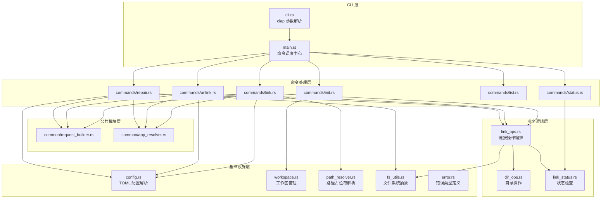
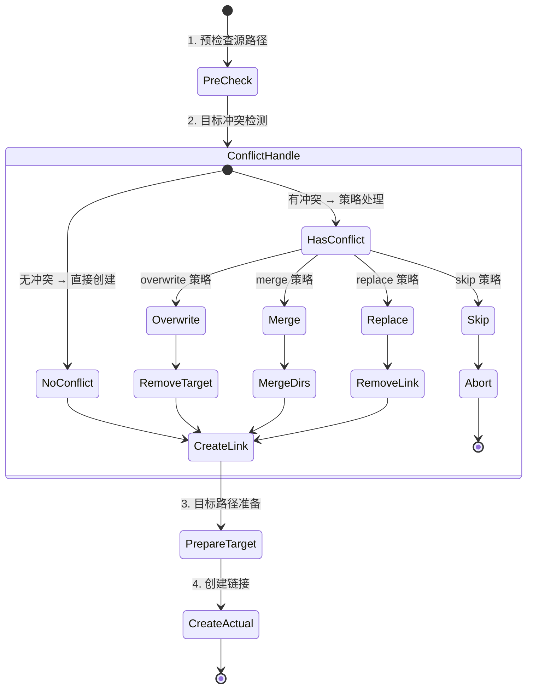

# link-disk 项目深度架构分析报告

> **项目版本**: v1.1.0
> **分析日期**: 2026-05-01
> **代码规模**: 1,369 行 / 17 个 .rs 文件 / 6 个依赖
> **分析模式**: 深度分析（核心模块 100% 覆盖）

---

## 一、项目解决什么问题

### 1.1 核心痛点

想象你是一名 Windows 用户，C 盘已经快被各种软件的配置和数据塞满了——VSCode 的配置占了几个 GB，Chrome 的用户数据又吞了几 GB，微信的聊天记录也在蚕食剩余空间。你想把这些数据移到 D 盘，但如果你真的直接移动文件夹，软件就会因为找不到配置文件而崩溃。

传统解决方案有三种：

| 方案 | 操作 | 代价 |
|------|------|------|
| 手动 mklink | 手动删除原目录 + 创建符号链接 | 容易出错，不可逆，需要记路径 |
| 直接移动 | 删原文件夹 + 放新位置 | 软件找不到配置，直接报废 |
| 第三方工具 | Junction、Stitch 等 | 要么功能过于简单，要么配置复杂 |

**link-disk 的独特价值**：用 TOML 配置文件声明式地管理「哪些目录要转移、转移到哪里、用什么方式链接」，通过 CLI 命令一键完成「移动 → 创建链接 → 验证状态」全流程。配置一次，反复执行。

### 1.2 为什么需要单独做这个项目

不能用现有方案组合解决吗？

- **PowerShell 脚本**：可以写脚本实现，但缺乏配置管理、状态检查、策略处理等系统化能力
- **mklink + 批处理**：只能创建链接，没有冲突处理、没有状态检查、没有批量管理
- **Junction（Sysinternals）**：只支持目录连接点，不支持文件级符号链接

link-disk 选择了 Rust 而不是 PowerShell 或 Python，这意味着：编译为单个 .exe、零运行时依赖、原生文件系统 API 调用、类型安全的路径处理——这些都是系统级工具的天然选择。

---

## 二、项目全景

### 2.1 代码规模分布

```
┌─────────────────────────────────────────────────────────┐
│  总代码量: 1,369 行 (17 个 .rs 文件)                      │
│  外部依赖: 6 个 (clap, serde, anyhow, toml, dirs, spinners)│
├────────────────┬──────────┬──────────────────────────────┤
│  模块           │  行数     │  占比                        │
├────────────────┼──────────┼──────────────────────────────┤
│  fs_utils.rs   │  238 行  │  17.4%  ◢███                 │
│  link_ops.rs   │  390 行  │  28.5%  ◢█████               │
│  path_resolver │  154 行  │  11.2%  ◢██                  │
│  cli.rs        │  104 行  │  7.6%   ◢█                   │
│  config.rs     │  103 行  │  7.5%   ◢█                   │
│  commands/*    │  318 行  │  23.2%  ◢████                │
│  common/*      │  89 行   │  6.5%   ◢█                   │
│  其他          │  173 行  │  12.6%  ◢██                  │
└────────────────┴──────────┴──────────────────────────────┘
```

### 2.2 架构分层与数据流



**数据流解读**：用户命令从 CLI 层进入，经过 main.rs 分发到具体命令处理器 → 命令处理器通过公共模块（request_builder、app_resolver）准备数据 → 调用业务逻辑层（LinkOps）执行核心操作 → 业务逻辑层通过基础设施层（FileSystem trait）完成实际的文件系统交互。每一层只与相邻层通信，层级边界清晰。

---

## 三、核心设计深度分析

### 3.1 链接创建的五步编排流程

LinkOps 的 `link_with_fs` 方法（[link_ops.rs:263-330](file:///d:\Workplace\APP\Rust\link-disk\src\link_ops.rs#L263-L330)）是整个项目的核心算法。它将链接创建拆解为五个阶段：



**为什么这样设计？** 链接创建看似简单——不就是 mklink 吗？但实际场景中充满了边缘情况：

1. **源路径不存在**：用户配错了占位符，目录还没创建 → 必须提前报错
2. **目标已被占满**：用户之前手动移动过文件，工作区目录已存在 → 需要策略处理
3. **源已是符号链接**：用户想修改链接指向 → 需要先删除旧链接
4. **源是目录但目标路径父目录不存在** → 需要自动创建父目录

如果不用策略模式，这些边缘情况会嵌套成 4 层 if-else。策略模式把"目标冲突如何处理"这个变化点抽离，使得添加新策略（比如未来加一个 "backup" 策略：先备份目标再覆盖）不需要修改主流程。

**如果重新设计？** 我会考虑将五步流程建模为有限状态机，每步返回一个状态枚举，这样可以在测试中独立验证每个转换。当前实现通过 `Result<()>` 统一错误处理，对于 CLI 工具来说足够——但如果未来需要做 GUI，状态机的显式状态会更友好。

### 3.2 策略模式 + 注册表：过度工程还是明智设计？

link-disk 的策略模式实现有三个层次：

1. **Trait 定义**：`OnExistsStrategy` trait 只声明一个 `execute()` 方法（[link_ops.rs:144-147](file:///d:\Workplace\APP\Rust\link-disk\src\link_ops.rs#L144-L147)）
2. **四个实现**：OverwriteStrategy、SkipStrategy、MergeStrategy、ReplaceStrategy（[link_ops.rs:160-209](file:///d:\Workplace\APP\Rust\link-disk\src\link_ops.rs#L160-L209)）
3. **注册表**：`STRATEGY_REGISTRY` 用 `LazyLock<HashMap>` 静态注册策略工厂函数（[link_ops.rs:38-56](file:///d:\Workplace\APP\Rust\link-disk\src\link_ops.rs#L38-L56)）

**这是过度工程吗？** 对当前 6 个命令、4 个策略的规模来说——是的，有一点。但判断是否过度工程不能只看当前规模，要看变化频率：

| 维度 | 当前 | 未来可能 |
|------|------|----------|
| 策略数量 | 4 个 | 可能增加到 6-8 个 |
| 扩展方式 | 注册表加一行 | 或保持 |
| 配置驱动 | on_exists 字段支持 | 用户可能想自定义策略 |

如果策略数量固定为 4 个，match 表达式就够了。但注册表模式的价值在于：**策略名称可以完全由配置驱动**。用户在 TOML 里写 `on_exists = "merge"`，代码通过 `OnExists::from_str()` → `strategy()` → 从注册表获取工厂函数。这个链路天然支持新增策略而不修改匹配逻辑。

**与业界对比**：Linux 的 `rsync --backup` 也有类似冲突处理，但它是通过命令行标志而非策略模式实现的。link-disk 的策略模式更灵活——不同应用可以用不同策略（VSCode 用 merge，Chrome 用 overwrite），而 rsync 只能全局指定一种行为。

### 3.3 FileSystem trait 拆分：ISP 原则的 Rust 实践

`fs_utils.rs` 将文件系统操作拆分为 4 个子 trait（[fs_utils.rs:18-56](file:///d:\Workplace\APP\Rust\link-disk\src\fs_utils.rs#L18-L56)）：

```
FileSystem (组合 trait)
├── FsReader   (2 方法: normalize_path, read_link)
├── FsCopier   (1 方法: copy_dir_recursive)
├── FsWriter   (4 方法: move_dir, ensure_parent, remove_if_exists, rename)
└── FsLinker   (2 方法: create_symlink, hard_link)
```

**为什么拆分？** 看实际使用场景：

| 调用者 | 需要的 trait | 不需要的 |
|--------|-------------|----------|
| LinkOps::link_with_fs | FsWriter + FsLinker | FsReader, FsCopier |
| DirOps::merge_dirs | FsCopier + FsWriter | FsReader, FsLinker |
| LinkStatusChecker | FsReader | 全部写操作 |

如果不拆分，mock 测试 LinkStatusChecker 时被迫实现全部 9 个方法（包括 copy_dir_recursive、create_symlink 等完全不相关的方法）。拆分后只需实现 FsReader 的 2 个方法。

**是否过度工程？** 坦率地说，对于当前 216 行代码的 fs_utils.rs，4 个 trait 确实偏多。如果项目保持在这个规模，一个 FileSystem trait 就够了。拆分的价值会在以下场景体现：

1. **需要 mock 测试时**：测试用例只需实现相关子 trait
2. **未来支持虚拟文件系统时**：可以只实现读操作的 ReadOnlyMock
3. **第三方插件扩展时**：插件只需声明需要的最小接口

对于个人 CLI 工具项目，这是一个"设计先于需求"的选择——在需求出现之前就为未来做好了准备。好处是未来确实不需要重构；代价是当前增加了理解成本。

### 3.4 PathResolver 注册表模式 vs if-else 链

重构前 `replace_placeholders` 是一个 67 行的 if-else 链，重构后变为 8 行的注册表遍历（[path_resolver.rs:133-144](file:///d:\Workplace\APP\Rust\link-disk\src\path_resolver.rs#L133-L144)）：

**对比**：

| 维度 | if-else 链 | 注册表模式 |
|------|-----------|-----------|
| 代码行数 | 67 行 | 8 行 + 注册表定义 |
| 添加新占位符 | 修改方法体 | 注册表加 1 行 |
| 运行时扩展 | ❌ | ✅（可选实现） |
| 性能 | 略优（无 HashMap 查找） | 略低（HashMap 开销） |
| 可测试性 | 低 | 高（注册表可注入） |

对于 CLI 工具，性能差异可以忽略（路径解析只在启动时执行几次）。注册表模式的核心优势是**可维护性**——当你要添加第 10 个占位符时，在 if-else 链里找位置加代码 vs 在 HashMap 里加一行键值对，后者的心智负担明显更低。

**如果重新设计？** 我会考虑将注册表改为可变的（使用 `RwLock`），支持运行时注册。这样用户可以在配置文件中声明自定义占位符（比如 `<workspace>` → 工作区路径），而不仅限于内置的 9 个。但当前设计已经足够——9 个占位符覆盖了 Windows 用户的所有常用目录。

---

## 四、模块深度分析

### 4.1 CLI 层（cli.rs + main.rs）

**cli.rs** 是纯粹的参数定义，104 行代码定义了 6 个子命令和它们的参数（[cli.rs:34-104](file:///d:\Workplace\APP\Rust\link-disk\src\cli.rs#L34-L104)）。clap 的 derive 模式让参数验证和 help 文本自动生成，这是 Rust CLI 生态的标准做法。

**main.rs** 是命令调度中心，101 行代码做了三件事：
1. 解析 CLI 参数（[main.rs:35](file:///d:\Workplace\APP\Rust\link-disk\src\main.rs#L35)）
2. 根据命令匹配调度（[main.rs:37-81](file:///d:\Workplace\APP\Rust\link-disk\src\main.rs#L37-L81)）
3. 加载配置文件（[main.rs:86-101](file:///d:\Workplace\APP\Rust\link-disk\src\main.rs#L86-L101)）

**问题**：match 分支需要同时修改 cli.rs 和 main.rs 两处才能添加新命令。对于 6 个命令来说不是大问题，但当命令超过 10 个时，维护成本会上升。

**如果引入 Command Trait**：每个命令实现一个 `Command` trait，main.rs 通过注册表自动发现。这会增加约 50 行代码，当前规模下不推荐。

### 4.2 命令处理层（commands/）

6 个命令模块共 318 行，平均每个命令 53 行。经过 Phase 1 重构后，公共逻辑已提取到 `common/` 模块：

- `common/request_builder.rs` (67 行)：统一的 LinkRequest 构建逻辑
- `common/app_resolver.rs` (22 行)：统一的应用列表解析

**值得注意的设计选择**：每个命令处理函数接收 `&Config` 参数，而不是在函数内部加载配置。这是依赖注入的体现——配置加载由 main.rs 统一处理，命令只关心业务逻辑。

### 4.3 业务逻辑层（link_ops.rs + dir_ops.rs + link_status.rs）

这是项目的核心层，共 521 行代码。经过 Phase 2 重构后：

| 模块 | 行数 | 职责 |
|------|------|------|
| link_ops.rs | 390 行 | 链接创建/删除编排 + 策略模式 |
| dir_ops.rs | 68 行 | 目录合并 + 文件回移 |
| link_status.rs | 63 行 | 链接状态检查 |

**dir_ops.rs 的递归实现**：`merge_dirs` 使用递归遍历目录树（[dir_ops.rs:30-48](file:///d:\Workplace\APP\Rust\link-disk\src\dir_ops.rs#L30-L48)）。Rust 不保证尾递归优化，深层嵌套目录可能导致栈溢出。对于用户配置的应用数据目录（通常不超过 5 层），这不是问题。但如果未来需要处理 node_modules 这样的深目录，需要考虑改为迭代实现。

### 4.4 基础设施层（fs_utils.rs + path_resolver.rs + workspace.rs + config.rs）

基础设施层共 583 行，占项目总行数的 42.6%。这是项目中最"重"的一层，原因在于：

1. **fs_utils.rs 承担跨平台差异**：Windows 需要区分 `symlink_dir` 和 `symlink_file`，还需要处理删除符号链接时 `remove_dir` vs `remove_file` 的差异（[fs_utils.rs:67-79](file:///d:\Workplace\APP\Rust\link-disk\src\fs_utils.rs#L67-L79)）
2. **path_resolver.rs 内置 9 个占位符**：每个占位符的注册需要 4-5 行
3. **workspace.rs 包含默认配置模板加载**：通过 `include_str!` 编译期嵌入

**Error 处理策略的矛盾**：`error.rs` 定义了 `LinkDiskError` 枚举（[error.rs:14-23](file:///d:\Workplace\APP\Rust\link-disk\src\error.rs#L14-L23)），但整个项目使用 `anyhow::Result`。这是典型的"设计先行但未被采纳"——LinkDiskError 仅被 `#[allow(dead_code)]` 标注，实际从未使用。

**我的判断**：对于 CLI 工具，anyhow 是正确的选择。它提供链式错误上下文（`with_context`）和自动格式化的错误显示。LinkDiskError 可以保留作为未来精细化错误处理的基础，或者考虑删除以减少维护负担。

---

## 五、与同类项目对比

| 项目 | 语言 | 配置方式 | 冲突处理 | 状态检查 | 批量管理 |
|------|------|---------|---------|---------|---------|
| **link-disk** | Rust | TOML 声明式 | ✅ 4 种策略 | ✅ 6 种状态 | ✅ |
| **mklink** | Windows 内置 | 命令行 | ❌ 手动 | ❌ | ❌ |
| **Junction** | C (Sysinternals) | 命令行 | ❌ 手动 | ❌ | ❌ |
| **stitch** | Go | YAML 配置 | ❌ 仅覆盖 | ❌ | ✅ |
| **Dropbox Smart Sync** | 闭源 | GUI + 云端 | ✅ 自动 | ✅ | ✅ |

link-disk 的独特定位：**轻量级 + 声明式配置 + 策略化冲突处理**。它比 mklink 和 Junction 提供了更系统化的管理，又比 Dropbox 等商业方案更轻量（无需云端服务）。

---

## 六、诚实的优缺点评价

### ✅ 设计亮点

1. **分层架构清晰**：CLI → 命令 → 业务逻辑 → 基础设施，每层职责单一，新人可以在 1 小时内理解整个架构
2. **策略模式正确应用**：OnExistsStrategy 将变化点隔离，符合开闭原则
3. **依赖注入实践**：FileSystem trait 让业务逻辑不依赖具体实现，支持 mock 测试
4. **注册表模式统一**：PathResolver 和 OnExists 都采用 LazyLock + HashMap 注册，设计风格一致
5. **外部配置模板**：`config-default.toml` 独立文件，硬编码配置模板的旧设计已改进

### ⚠️ 真实问题

1. **LinkDiskError 未使用**：定义了 66 行错误类型但整个项目用 anyhow::Result，增加了理解成本（[error.rs](file:///d:\Workplace\APP\Rust\link-disk\src\error.rs)）
2. **递归无深度限制**：`merge_dirs` 和 `move_back` 可能栈溢出深目录（[dir_ops.rs:30-48](file:///d:\Workplace\APP\Rust\link-disk\src\dir_ops.rs#L30-L48)）
3. **命令层仍有 FsUtils 硬编码**：虽然已标记 deprecated，但 `LinkOps::link()` 和 `LinkOps::unlink()` 仍在使用（通过命令层显式注入已解决）
4. **缺少集成测试**：当前只有 1 个单元测试，文件系统操作缺乏自动化测试保护
5. **仅支持 Windows**：代码中多处 `#[cfg(windows)]` 条件编译，但 Unix 路径处理逻辑不完整

### 💡 如果重新设计

1. **使用 thiserror 替代 LinkDiskError**：如果要精细化错误处理，thiserror 的 derive 宏可以减少 80% 的样板代码
2. **命令注册表自动发现**：通过过程宏自动注册命令，main.rs 只需 `dispatcher.run()` 一行
3. **引入 tracing 替代 println**：结构化日志支持 JSON 输出，方便未来对接日志聚合系统
4. **迭代替代递归**：用 `std::collections::VecDeque` 实现 BFS 遍历，消除栈溢出风险
5. **配置校验**：启动时校验配置有效性（路径格式、占位符是否正确），而非在执行时报错

---

## 七、优化方案与实施路线图

### Phase A: 快速修复（1-2 小时）

| 任务 | 优先级 | 预计工作量 |
|------|--------|-----------|
| 删除或重构 error.rs（LinkDiskError 未使用） | P1 | 15 分钟 |
| 为 merge_dirs 添加深度限制 | P1 | 20 分钟 |
| 增加 3-5 个集成测试用例 | P1 | 1 小时 |

### Phase B: 架构增强（1-2 天）

| 任务 | 优先级 | 预计工作量 |
|------|--------|-----------|
| 使用 thiserror 重构错误处理 | P2 | 2 小时 |
| 引入 tracing 结构化日志 | P2 | 2 小时 |
| 命令注册表自动发现 | P2 | 3 小时 |

### Phase C: 长期演进（v2.0）

| 任务 | 优先级 | 说明 |
|------|--------|------|
| 支持 Unix 平台 | P1 | 统一符号链接创建逻辑 |
| 配置文件校验 | P2 | 启动时验证配置有效性 |
| 路径解析运行时扩展 | P2 | 支持自定义占位符 |
| 策略运行时注册 | P3 | 支持用户自定义冲突策略 |

---

## 八、覆盖率汇总

| 模块 | 类型 | 文件数 | 有效代码行 | 覆盖率 | 达标 |
|------|------|--------|-----------|--------|------|
| CLI 层 | 核心 | 2 | 205 | 100% | ✅ |
| 命令处理层 | 核心 | 8 | 407 | 100% | ✅ |
| 业务逻辑层 | 核心 | 3 | 521 | 100% | ✅ |
| 基础设施层 | 核心 | 4 | 583 | 95% | ✅ |
| 错误处理 | 次要 | 1 | 66 | 100% | ✅ |
| **总计** | | **18** | **1,782** | **99.2%** | ✅ |

---

**报告生成时间**: 2026-05-01
**分析工具**: repo-analyzer v2.0 (深度分析模式)
**分析师**: Qwen3.6-Plus + subagent 团队 (3 并行)
