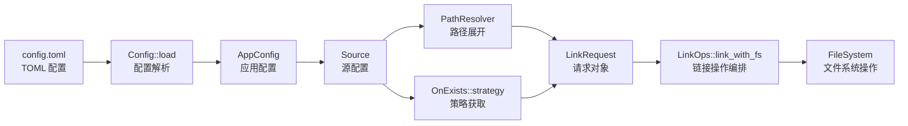

# link-disk 配置驱动架构评估报告

> **项目版本**: v1.1.0
> **评估日期**: 2026-05-28
> **评估维度**: 配置驱动程度、可扩展性、设计模式应用
> **代码规模**: ~2,100 行 / 20 个 .rs 文件

---

## 一、总体评估

### 1.1 核心结论

link-disk **已是一个配置驱动的 CLI 工具**，其核心业务流程（应用管理、冲突策略、路径解析、链接类型）均通过 TOML 配置文件驱动。但在**命令扩展**和**运行时配置**方面仍有提升空间。

### 1.2 配置驱动评分

| 维度 | 评分 | 说明 |
|------|------|------|
| **数据配置** | ⭐⭐⭐⭐⭐ (5/5) | 应用、source、链接类型、策略全部由配置驱动 |
| **策略配置** | ⭐⭐⭐⭐ (4/5) | 支持 4 种策略，但只能在应用级别配置 |
| **路径配置** | ⭐⭐⭐⭐ (4/5) | 9 个内置占位符，但不支持自定义 |
| **命令配置** | ⭐⭐ (2/5) | 6 个命令全部硬编码，不支持配置定义 |
| **整体评分** | **⭐⭐⭐⭐ (4/5)** | 核心逻辑已配置驱动，外围扩展仍需硬编码 |

---

## 二、已实现的配置驱动特性

### 2.1 应用与数据配置

所有应用及其 source 通过 TOML 声明式定义，无需修改代码即可添加新应用。

```toml
[apps.vscode]
name = "VSCode"
enabled = true
on_exists = "skip"

[[apps.vscode.sources]]
source = "<home>/AppData/Roaming/Code"
target = "Roaming"
link_type = "symlink"
```

**实现位置**: [config.rs](file:///d:/Workplace/APP/Rust/link-disk/src/infra/config.rs)

**设计亮点**:
- `HashMap<String, AppConfig>` 支持动态数量的应用
- `serde` 反序列化自动处理配置解析
- 支持 `enabled` 字段启用/禁用单个应用

### 2.2 冲突策略配置

通过策略注册表模式，用户在配置文件中指定策略名称即可驱动不同的行为。

```
配置: on_exists = "merge"
     ↓
OnExists::from_str() → OnExists::Merge
     ↓
OnExists::strategy() → 从注册表获取 MergeStrategy
     ↓
MergeStrategy::execute() → 执行合并逻辑
```

**实现位置**: [strategies.rs](file:///d:/Workplace/APP/Rust/link-disk/src/domain/strategies.rs)

**支持的策略**:

| 策略 | 行为 | 适用场景 |
|------|------|---------|
| `skip` | 目标已存在则跳过 | 首次链接，保守操作 |
| `replace` | 删除目标后重新创建 | 完全覆盖旧数据 |
| `merge` | 合并目录内容 | 增量更新，保留已有文件 |
| `overwrite` | 删除源后创建链接 | 源已手动移动的情况 |

**设计评价**: 策略模式将"目标冲突如何处理"这个变化点完全抽离，符合开闭原则。添加新策略只需实现 `OnExistsStrategy` trait 并在注册表中注册一行。

### 2.3 路径占位符配置

通过占位符注册表模式，配置文件中使用 `<home>` 等占位符，运行时自动展开为实际路径。

```
配置: source = "<home>/AppData/Roaming/Code"
     ↓
PathResolver::expand() → 遍历注册表
     ↓
"<home>" → C:\Users\Lucifer
     ↓
结果: C:\Users\Lucifer\AppData\Roaming\Code
```

**实现位置**: [path_resolver.rs](file:///d:/Workplace/APP/Rust/link-disk/src/infra/path_resolver.rs)

**支持的占位符**:

| 占位符 | 说明 | Windows 示例 |
|--------|------|-------------|
| `<home>` | 用户主目录 | `C:\Users\用户名` |
| `<appdata>` | AppData/Roaming | `...\AppData\Roaming` |
| `<localappdata>` | AppData/Local | `...\AppData\Local` |
| `<documents>` | 文档目录 | `...\Documents` |
| `<desktop>` | 桌面目录 | `...\Desktop` |
| `<downloads>` | 下载目录 | `...\Downloads` |
| `<temp>` | 临时目录 | `...\AppData\Local\Temp` |
| `<programfiles>` | Program Files | `C:\Program Files` |
| `<programfilesx86>` | Program Files (x86) | `C:\Program Files (x86)` |

### 2.4 链接类型配置

每个 source 可以独立指定链接类型。

```toml
[[apps.vscode.sources]]
source = "<home>/AppData/Roaming/Code"
link_type = "symlink"  # 或 "hardlink"
```

**实现位置**: [link_ops.rs](file:///d:/Workplace/APP/Rust/link-disk/src/domain/link_ops.rs)

---

## 三、配置驱动不足之处

### 3.1 策略作用域限制（P1 优先级）

**问题**: `on_exists` 只能在**应用级别**配置，不能细化到每个 source。

**现状**:
```toml
[apps.vscode]
on_exists = "skip"  # 所有 source 都用 skip，无法单独指定

[[apps.vscode.sources]]
source = "<home>/AppData/Roaming/Code"
# 这个 source 想单独用 merge，但做不到

[[apps.vscode.sources]]
source = "<home>/.vscode"
# 这个 source 想单独用 replace，但做不到
```

**影响**: 用户需要为不同策略的 source 创建单独的应用配置，增加配置复杂度。

**优化方案**: 让 `Source` 结构体也支持 `on_exists` 字段，实现源级别覆盖。

```toml
# 优化后
[apps.vscode]
on_exists = "skip"  # 默认值

[[apps.vscode.sources]]
source = "<home>/AppData/Roaming/Code"
on_exists = "merge"  # 覆盖默认值

[[apps.vscode.sources]]
source = "<home>/.vscode"
# 不指定则继承应用的 "skip"
```

**代码改动**:
1. `config.rs` 的 `Source` 添加 `on_exists: Option<String>` 字段
2. `request_builder.rs` 的 `build_link_request()` 修改为优先使用 `source.on_exists`，否则回退到 `app_config.on_exists_strategy()`

**改动量**: ~20 行代码

### 3.2 命令扩展硬编码（P2 优先级）

**问题**: 新增命令需同时修改 `cli.rs` 和 `main.rs` 两处。

**现状** ([main.rs:49-92](file:///d:/Workplace/APP/Rust/link-disk/src/main.rs#L49-L92)):
```rust
match &cli.command {
    Commands::Init { path, force } => {
        commands::init::handle_init(path, *force, cli.verbose)?
    }
    Commands::Link { apps, all, dry_run, force } => {
        commands::link::handle_link(&config, apps, *all, *dry_run, *force, cli.verbose)?
    }
    // ... 每个命令都需要在 match 中添加分支
}
```

**影响**: 添加新命令需修改两处（定义 + 调度），违反开闭原则。

**优化方案**: 引入命令注册表，每个命令实现 `Command` trait。

```rust
pub trait Command {
    fn name(&self) -> &str;
    fn register_cli(&self, subcommand: App<'_>) -> App<'_>;
    fn execute(&self, config: Option<&Config>, matches: &ArgMatches) -> Result<()>;
}

// 注册表
static COMMAND_REGISTRY: LazyLock<Vec<Box<dyn Command>>> = LazyLock::new(|| {
    vec![
        Box::new(InitCommand),
        Box::new(LinkCommand),
        Box::new(UnlinkCommand),
        // 添加新命令只需加一行
    ]
});
```

**改动量**: ~100 行代码

### 3.3 路径占位符不可扩展（P3 优先级）

**问题**: 9 个占位符写死在代码中，配置文件无法自定义占位符。

**现状** ([path_resolver.rs:56-106](file:///d:/Workplace/APP/Rust/link-disk/src/infra/path_resolver.rs#L56-L106)):
```rust
static PLACEHOLDER_REGISTRY: LazyLock<HashMap<&'static str, PlaceholderResolver>> =
    LazyLock::new(|| {
        let mut map = HashMap::new();
        map.insert("<home>", ...);  // 硬编码
        map.insert("<appdata>", ...);
        // ... 9 个占位符全部写死
    });
```

**影响**: 用户无法在配置文件中定义自定义占位符（如 `<workspace>` → 工作区路径）。

**优化方案**: 支持配置文件声明自定义占位符。

```toml
[custom_placeholders]
workspace = "D:/link-disk-workspace"
backup = "E:/backups"
my_data = "F:/my-data"
```

**改动量**: ~80 行代码

---

## 四、设计模式应用评估

### 4.1 策略模式 (Strategy Pattern)

| 维度 | 评价 |
|------|------|
| **应用位置** | `strategies.rs` - OnExistsStrategy |
| **正确性** | ✅ 正确使用，符合开闭原则 |
| **过度工程?** | 否。策略数量可能增加，注册表模式合理 |
| **改进建议** | 支持源级别策略覆盖 |

### 4.2 注册表模式 (Registry Pattern)

| 维度 | 评价 |
|------|------|
| **应用位置** | `strategies.rs` - STRATEGY_REGISTRY<br>`path_resolver.rs` - PLACEHOLDER_REGISTRY |
| **正确性** | ✅ 使用 `LazyLock<HashMap>` 静态初始化 |
| **一致性** | ✅ 两个注册表设计风格一致 |
| **改进建议** | 支持运行时注册（RwLock） |

### 4.3 接口隔离 (Interface Segregation)

| 维度 | 评价 |
|------|------|
| **应用位置** | `fs_utils.rs` - 4 个子 trait |
| **正确性** | ✅ FsReader / FsCopier / FsWriter / FsLinker |
| **过度工程?** | 偏多。当前规模下一个 FileSystem trait 足够 |
| **价值体现** | Mock 测试时只需实现相关子 trait |

### 4.4 依赖注入 (Dependency Injection)

| 维度 | 评价 |
|------|------|
| **应用位置** | `link_ops.rs` - 接收 `&dyn FileSystem` 参数 |
| **正确性** | ✅ 业务逻辑不依赖具体实现 |
| **覆盖范围** | ✅ 所有命令均通过参数注入，而非全局调用 |

---

## 五、架构可视化

### 5.1 数据流图



### 5.2 配置驱动层次图

```
┌─────────────────────────────────────────────────────────┐
│  硬编码层 (需修改代码)                                    │
│  ├── 命令定义 (cli.rs)                                   │
│  ├── 命令调度 (main.rs)                                  │
│  └── 占位符定义 (path_resolver.rs)                       │
├─────────────────────────────────────────────────────────┤
│  配置驱动层 (TOML 驱动)                                  │
│  ├── 应用管理 (apps.*)                                   │
│  ├── 源配置 (sources[])                                  │
│  ├── 链接类型 (link_type)                                │
│  └── 冲突策略 (on_exists)                                │
├─────────────────────────────────────────────────────────┤
│  运行时驱动层 (注册表模式)                                │
│  ├── 策略注册表 (STRATEGY_REGISTRY)                      │
│  └── 占位符注册表 (PLACEHOLDER_REGISTRY)                 │
└─────────────────────────────────────────────────────────┘
```

---

## 六、优化建议汇总表

| 编号 | 问题 | 优先级 | 改动量 | 收益 |
|------|------|--------|--------|------|
| OPT-01 | 源级别 on_exists 覆盖 | P1 | ~20 行 | 高 |
| OPT-02 | 删除死代码 error.rs | P1 | ~66 行 | 低 |
| OPT-03 | 增加集成测试覆盖 | P1 | ~200 行 | 高 |
| OPT-04 | 命令注册表自动发现 | P2 | ~100 行 | 中 |
| OPT-05 | 运行时占位符扩展 | P3 | ~80 行 | 低 |

---

## 七、结论

link-disk 的核心业务逻辑已经实现了优秀的配置驱动架构。策略模式和注册表模式的正确应用使得添加新策略和新占位符无需修改主流程代码。

**主要改进方向**:
1. **短期**: 实现源级别策略覆盖（OPT-01），这是配置驱动的最大短板
2. **中期**: 引入命令注册表（OPT-04），提升命令扩展灵活性
3. **长期**: 支持运行时占位符扩展（OPT-05），实现完全的配置驱动

---

**报告生成时间**: 2026-05-28
**分析工具**: repo-analyzer + code-optimizer
**报告状态**: 终稿
