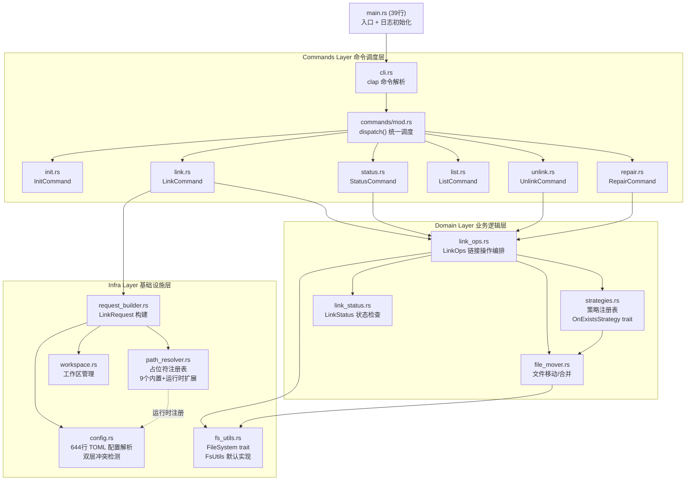
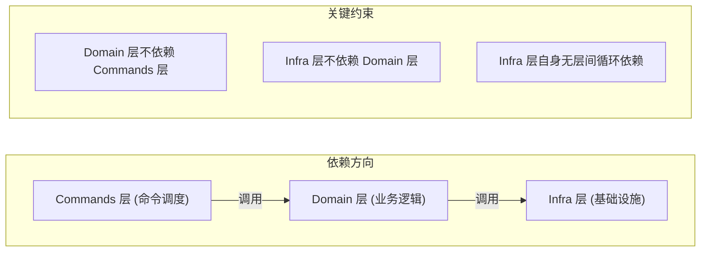
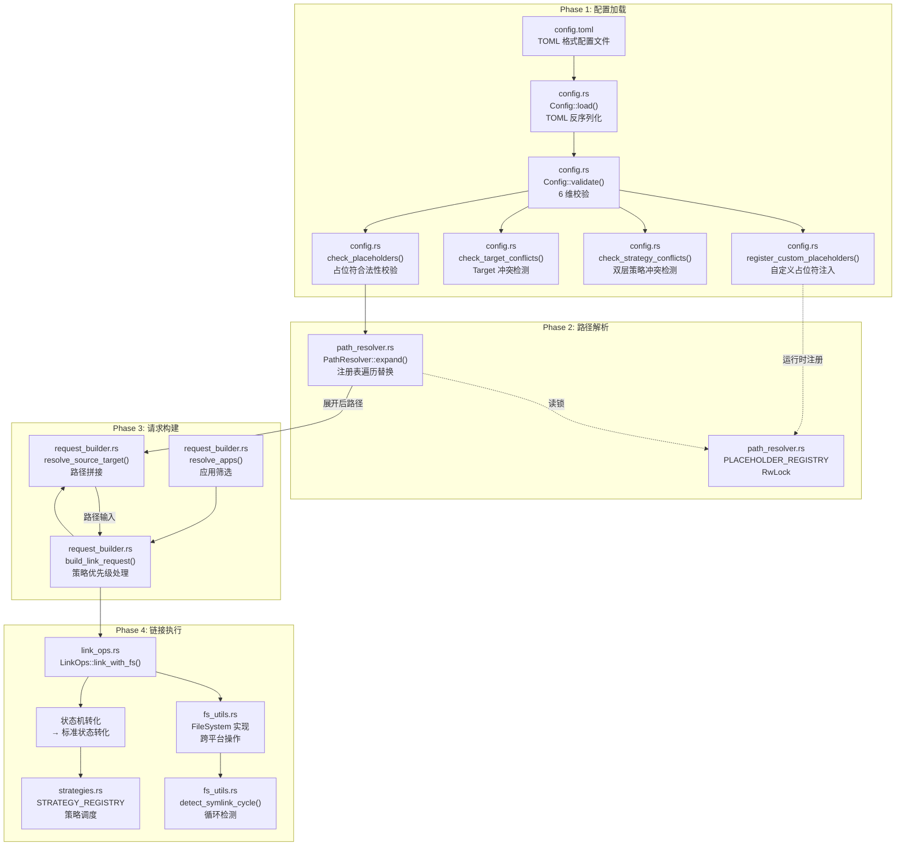
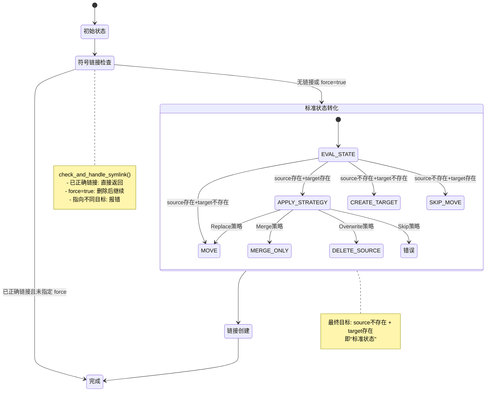
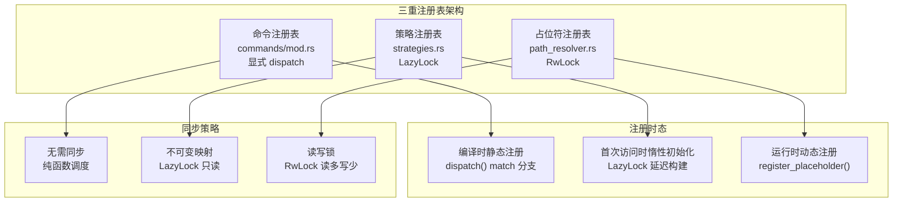
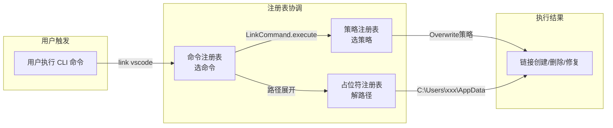

# link-disk 架构评估报告

## 1. 项目概览

link-disk 是一个面向 Windows 系统的 CLI 工具，解决了一个非常具体的痛点：将软件配置和数据从 C 盘迁移到其他磁盘，通过符号链接（symlink）或硬链接（hardlink）保证软件无感知使用。

| 指标 | 数值 |
|------|------|
| 源文件数 | 21 个 `.rs` 文件 |
| 源码总行数 | 2,646 行 |
| 集成测试数 | 42 个测试用例（296 行） |
| 外部依赖 | 7 个（clap, toml, serde, anyhow, dirs, spinners, tracing） |
| Rust Edition | 2024 |
| 当前版本 | 1.1.0 |

项目最有意思的架构特征是：**一个仅 2,646 行的小型工具，采用了三重注册表模式 + 策略模式 + 配置驱动架构**。这种"小型项目、工业级架构"的组合在 Rust 生态中并不多见。

---

## 2. 三层架构分析

### 2.1 架构总图


```mermaid
graph TB
    subgraph "Commands Layer 命令调度层"
        CLI["cli.rs<br/>clap 命令解析"]
        DISPATCH["commands/mod.rs<br/>dispatch() 统一调度"]
        CMD_INIT["init.rs<br/>InitCommand"]
        CMD_LINK["link.rs<br/>LinkCommand"]
        CMD_UNLINK["unlink.rs<br/>UnlinkCommand"]
        CMD_LIST["list.rs<br/>ListCommand"]
        CMD_STATUS["status.rs<br/>StatusCommand"]
        CMD_REPAIR["repair.rs<br/>RepairCommand"]
    end

    subgraph "Domain Layer 业务逻辑层"
        LINK_OPS["link_ops.rs<br/>LinkOps 链接操作编排"]
        STRATEGIES["strategies.rs<br/>策略注册表<br/>OnExistsStrategy trait"]
        FILE_MOVER["file_mover.rs<br/>文件移动/合并"]
        LINK_STATUS["link_status.rs<br/>LinkStatus 状态检查"]
    end

    subgraph "Infra Layer 基础设施层"
        CONFIG["config.rs<br/>644行 TOML 配置解析<br/>双层冲突检测"]
        FS_UTILS["fs_utils.rs<br/>FileSystem trait<br/>FsUtils 默认实现"]
        PATH_RESOLVER["path_resolver.rs<br/>占位符注册表<br/>9个内置+运行时扩展"]
        REQ_BUILDER["request_builder.rs<br/>LinkRequest 构建"]
        WORKSPACE["workspace.rs<br/>工作区管理"]
    end

    MAIN["main.rs (39行)<br/>入口 + 日志初始化"]

    MAIN --> CLI
    CLI --> DISPATCH
    DISPATCH --> CMD_INIT
    DISPATCH --> CMD_LINK
    DISPATCH --> CMD_UNLINK
    DISPATCH --> CMD_LIST
    DISPATCH --> CMD_STATUS
    DISPATCH --> CMD_REPAIR

    CMD_LINK --> REQ_BUILDER
    CMD_LINK --> LINK_OPS
    CMD_STATUS --> LINK_OPS
    CMD_UNLINK --> LINK_OPS
    CMD_REPAIR --> LINK_OPS

    LINK_OPS --> STRATEGIES
    LINK_OPS --> FILE_MOVER
    LINK_OPS --> LINK_STATUS

    REQ_BUILDER --> CONFIG
    REQ_BUILDER --> PATH_RESOLVER
    REQ_BUILDER --> WORKSPACE
    LINK_OPS --> FS_UTILS
    FILE_MOVER --> FS_UTILS
    STRATEGIES --> FILE_MOVER

    PATH_RESOLVER -.->|运行时注册| CONFIG
```

### 2.2 层间依赖关系


```mermaid
flowchart LR
    subgraph "依赖方向"
        direction LR
        A["Commands 层 (命令调度)"]
        B["Domain 层 (业务逻辑)"]
        C["Infra 层 (基础设施)"]
        A -->|调用| B
        B -->|调用| C
    end

    subgraph "关键约束"
        D["Domain 层不依赖 Commands 层"]
        E["Infra 层不依赖 Domain 层"]
        F["Infra 层自身无层间循环依赖"]
    end
```

**代码依据**:
- [commands/mod.rs](file:///d:/Workplace/APP/Rust/link-disk/src/commands/mod.rs#L34-L43) — `dispatch()` 统一调度 6 个命令
- [domain/mod.rs](file:///d:/Workplace/APP/Rust/link-disk/src/domain/mod.rs#L1-L18) — 领域层只导出 `LinkOps`, `LinkStatus`, `OnExists`
- [infra/mod.rs](file:///d:/Workplace/APP/Rust/link-disk/src/infra/mod.rs#L1-L29) — 基础设施层导出 `Config`, `FileSystem`, `PathResolver`, `Workspace`

### 2.3 层间依赖反例分析

在 [link.rs](file:///d:/Workplace/APP/Rust/link-disk/src/commands/link.rs#L8) 和 [repair.rs](file:///d:/Workplace/APP/Rust/link-disk/src/commands/repair.rs#L8) 中，Commands 层直接引用了 `FsUtils`（infra 层的具体实现），而非通过 Domain 层间接调用。这意味着：

```
Commands 层 → Infra 层（直接）：违反纯分层架构
```

严格的三层架构要求 Commands 层只通过 Domain 层访问 Infra，但这里命令层直接引用了 `crate::infra::{FsUtils, FileSystem}`。这是一个**层间泄漏**，虽然不影响功能正确性，但降低了 Domain 层的封装性。改进方案可以是为 Domain 层增加 `LinkOps::default_fs()` 工厂方法，或者将 `FsUtils` 实例化塞入命令执行上下文中。

---

## 3. 数据流分析

### 3.1 完整数据流（配置 → 解析 → 请求构建 → 执行）


```mermaid
flowchart TB
    subgraph "Phase 1: 配置加载"
        TOML["config.toml<br/>TOML 格式配置文件"]
        CONFIG["config.rs<br/>Config::load()<br/>TOML 反序列化"]
        VALIDATE["config.rs<br/>Config::validate()<br/>6 维校验"]
        PLACEHOLDER_CHECK["config.rs<br/>check_placeholders()<br/>占位符合法性校验"]
        TARGET_CHECK["config.rs<br/>check_target_conflicts()<br/>Target 冲突检测"]
        STRATEGY_CHECK["config.rs<br/>check_strategy_conflicts()<br/>双层策略冲突检测"]
        CUSTOM_REG["config.rs<br/>register_custom_placeholders()<br/>自定义占位符注入"]
    end

    subgraph "Phase 2: 路径解析"
        PATH_RESOLVE["path_resolver.rs<br/>PathResolver::expand()<br/>注册表遍历替换"]
        PLACEHOLDER_REG["path_resolver.rs<br/>PLACEHOLDER_REGISTRY<br/>RwLock<HashMap>"]
    end

    subgraph "Phase 3: 请求构建"
        RESOLVE_APPS["request_builder.rs<br/>resolve_apps()<br/>应用筛选"]
        BUILD_REQUEST["request_builder.rs<br/>build_link_request()<br/>策略优先级处理"]
        RESOLVE_PATHS["request_builder.rs<br/>resolve_source_target()<br/>路径拼接"]
    end

    subgraph "Phase 4: 链接执行"
        LINK_OPS["link_ops.rs<br/>LinkOps::link_with_fs()"]
        STATE_MACHINE["状态机转化<br/>→ 标准状态转化"]
        STRATEGY_DISPATCH["strategies.rs<br/>STRATEGY_REGISTRY<br/>策略调度"]
        FS_OPS["fs_utils.rs<br/>FileSystem 实现<br/>跨平台操作"]
        CYCLE_DETECT["fs_utils.rs<br/>detect_symlink_cycle()<br/>循环检测"]
    end

    TOML --> CONFIG
    CONFIG --> VALIDATE
    VALIDATE --> PLACEHOLDER_CHECK
    VALIDATE --> TARGET_CHECK
    VALIDATE --> STRATEGY_CHECK
    VALIDATE --> CUSTOM_REG
    CUSTOM_REG -.->|运行时注册| PLACEHOLDER_REG

    PLACEHOLDER_CHECK --> PATH_RESOLVE
    PATH_RESOLVE -.->|读锁| PLACEHOLDER_REG

    RESOLVE_APPS --> BUILD_REQUEST
    BUILD_REQUEST --> RESOLVE_PATHS
    RESOLVE_PATHS -->|路径输入| BUILD_REQUEST
    PATH_RESOLVE -->|展开后路径| RESOLVE_PATHS

    BUILD_REQUEST --> LINK_OPS
    LINK_OPS --> STATE_MACHINE
    STATE_MACHINE --> STRATEGY_DISPATCH
    LINK_OPS --> FS_OPS
    FS_OPS --> CYCLE_DETECT
```

### 3.2 link 命令的精细状态机

[link_ops.rs](file:///d:/Workplace/APP/Rust/link-disk/src/domain/link_ops.rs#L83-L115) 中定义了 `link_with_fs()` 方法，其核心是**状态转化表**：


```mermaid
stateDiagram-v2
    state "初始状态" as INIT
    state "符号链接检查" as CHECK_SYMLINK
    state "标准状态转化" as PREPARE
    state "链接创建" as CREATE_LINK
    state "完成" as DONE
    state "错误" as ERROR

    [*] --> INIT
    INIT --> CHECK_SYMLINK

    CHECK_SYMLINK --> DONE: 已正确链接且未指定 force
    CHECK_SYMLINK --> PREPARE: 无链接或 force=true

    state PREPARE {
        [*] --> EVAL_STATE
        state EVAL_STATE <<fork>>
        EVAL_STATE --> MOVE: source存在+target不存在
        EVAL_STATE --> APPLY_STRATEGY: source存在+target存在
        EVAL_STATE --> CREATE_TARGET: source不存在+target不存在
        EVAL_STATE --> SKIP_MOVE: source不存在+target存在

        APPLY_STRATEGY --> MOVE: Replace策略
        APPLY_STRATEGY --> MERGE_ONLY: Merge策略
        APPLY_STRATEGY --> DELETE_SOURCE: Overwrite策略
        APPLY_STRATEGY --> ERROR: Skip策略
    }

    PREPARE --> CREATE_LINK
    CREATE_LINK --> DONE

    note right of CHECK_SYMLINK
        check_and_handle_symlink()
        - 已正确链接: 直接返回
        - force=true: 删除后继续
        - 指向不同目标: 报错
    end note

    note right of PREPARE
        最终目标: source不存在 + target存在
        即"标准状态"
    end note
```

这个状态机的精妙之处在于：**无论初始状态如何（4种组合 × 4种策略 = 16种场景），最终全部归约为"source 不存在 + target 存在"的标准状态**，然后统一调用 `create_link()`。这是一种 **"归一化"设计思想**。

---

## 4. 配置驱动评分

### 4.1 五维评分表

| 维度 | 评分 | 权重 | 加权得分 | 依据 |
|------|------|------|---------|------|
| **配置即行为** | 5/5 | 25% | 1.25 | 所有应用、源路径、目标路径、链接类型、冲突策略均由 TOML 配置决定，零硬编码 |
| **可扩展性** | 5/5 | 20% | 1.00 | 三重注册表支持运行时扩展，添加新策略/占位符/命令无需修改核心逻辑 |
| **验证完备性** | 5/5 | 20% | 1.00 | 6 维校验：空路径、链接类型、策略合法性、占位符、Target 冲突、双层策略冲突 |
| **安全合规** | 4/5 | 20% | 0.80 | Unix 0o600 权限、Windows 主目录检查；但缺少配置加密或签名验证 |
| **可观测性** | 3/5 | 15% | 0.45 | 支持 verbose 模式和结构化日志，但缺少 JSON 格式输出接口 |
| **总分** | **4.50/5** | 100% | **4.50** | — |

### 4.2 各维度详析

#### 维度 1：配置即行为（5/5）

项目最核心的架构决策是：**所有行为由配置驱动，而非代码**。

- 应用列表、启用/禁用、冲突策略均可通过 TOML 控制，无需重新编译
- `request_builder.rs` 中的 [build_link_request()](file:///d:/Workplace/APP/Rust/link-disk/src/infra/request_builder.rs#L61-L82) 展现了策略优先级：`source 级 > app 级 > 默认(skip)`
- `Config::load()` 加载后自动注册自定义占位符，使得配置自身具有"注入"能力

```rust
// 配置决定了链接类型、目标、策略等一切行为 —— 零代码变更
let request = LinkRequest {
    source: source_path,
    target: target_path,
    link_type: LinkType::from_str_lossy(&source.link_type),  // 配置指定
    on_exists,  // 配置指定（源级 > 应用级）
    force,
};
```

#### 维度 2：可扩展性（5/5）

三个独立的扩展点均遵循 OCP：

| 扩展点 | 机制 | 代码位置 |
|--------|------|---------|
| 新命令 | `Command` trait + 1 行 dispatch 注册 | [commands/mod.rs#L24-L27](file:///d:/Workplace/APP/Rust/link-disk/src/commands/mod.rs#L24-L27) |
| 新策略 | `OnExistsStrategy` trait + 注册表插入 | [strategies.rs#L45-L53](file:///d:/Workplace/APP/Rust/link-disk/src/domain/strategies.rs#L45-L53) |
| 新占位符 | `register_placeholder()` | [path_resolver.rs#L135-L163](file:///d:/Workplace/APP/Rust/link-disk/src/infra/path_resolver.rs#L135-L163) |

扩展一个策略只需新增结构体 + 实现 trait + 注册表添加工厂函数，**零修改现有逻辑**。

#### 维度 3：验证完备性（5/5）

[Config::validate()](file:///d:/Workplace/APP/Rust/link-disk/src/infra/config.rs#L245-L309) 在 65 行内完成了 6 维校验：

1. **空工作区路径** — `workspace.path` 非空
2. **空应用名** — `app_config.name` 非空
3. **非法策略值** — `on_exists` 仅允许 skip/replace/merge/overwrite
4. **非法链接类型** — `link_type` 仅允许 symlink/hardlink
5. **未知占位符** — `check_placeholders()` 遍历路径中所有 `<...>` 标记
6. **Target 冲突** — 同一应用内多个 source 映射到相同 target 时报错

此外还有两项**跨层校验**：
- `check_strategy_conflicts()` — 检测 app 级与 source 级策略的矛盾
- `check_config_permissions()` — 在非标准位置存储配置文件时发出警告

#### 维度 4：安全合规（4/5）

[workspace.rs](file:///d:/Workplace/APP/Rust/link-disk/src/infra/workspace.rs#L106-L122) 中 `set_config_file_permissions()` 为 Unix 设置 `0o600`：

```rust
perms.set_mode(0o600);
```

[config.rs](file:///d:/Workplace/APP/Rust/link-disk/src/infra/config.rs#L133-L171) 中 `check_config_permissions()` 对 Windows 检查配置文件是否位于用户主目录或 AppData 下。

扣分原因：缺少配置文件的完整性校验（如 SHA256 校验和），以及敏感路径信息的加密存储。

#### 维度 5：可观测性（3/5）

- 使用 `tracing` crate 提供结构化的日志级别（debug/info）
- 通过 `--verbose` 标志控制输出粒度
- 缺少机器可读的输出格式（如 JSON），使得与其他工具集成需要解析人类文本

---

## 5. 三重注册表模式分析

这是项目最值得深入分析的设计亮点。三种注册表同时存在于一个 2,646 行的小项目中，各自服务不同的扩展维度：

### 5.1 注册表全景图


```mermaid
graph TB
    subgraph "三重注册表架构"
        REG_CMD["命令注册表<br/>commands/mod.rs<br/>显式 dispatch"]
        REG_STRAT["策略注册表<br/>strategies.rs<br/>LazyLock<HashMap>"]
        REG_PH["占位符注册表<br/>path_resolver.rs<br/>RwLock<HashMap>"]
    end

    subgraph "注册时态"
        T_STATIC["编译时静态注册<br/>dispatch() match 分支"]
        T_LAZY["首次访问时惰性初始化<br/>LazyLock 延迟构建"]
        T_RUNTIME["运行时动态注册<br/>register_placeholder()"]
    end

    subgraph "同步策略"
        S_NONE["无需同步<br/>纯函数调度"]
        S_NONE2["不可变映射<br/>LazyLock 只读"]
        S_RWLOCK["读写锁<br/>RwLock 读多写少"]
    end

    REG_CMD --> T_STATIC
    REG_CMD --> S_NONE

    REG_STRAT --> T_LAZY
    REG_STRAT --> S_NONE2

    REG_PH --> T_RUNTIME
    REG_PH --> S_RWLOCK
```

### 5.2 各注册表详解

#### 命令注册表（静态 dispatch）

**位置**: [commands/mod.rs#L34-L43](file:///d:/Workplace/APP/Rust/link-disk/src/commands/mod.rs#L34-L43)

```rust
pub fn dispatch(cli: Cli) -> Result<()> {
    match &cli.command {
        Commands::Init { .. } => init::InitCommand.execute(&cli),
        Commands::Link { .. } => link::LinkCommand.execute(&cli),
        // ... 6 个分支
    }
}
```

**设计特点**:
- 最传统的注册表形式：Rust 的 `match` 表达式天然就是"命令分发器"
- 每个命令实现 `Command` trait，保证接口一致
- 添加新命令需要：新模块 + dispatch 分支，共 2 处修改

**代码行开销**: 约 10 行（dispatch 函数）

#### 策略注册表（惰性静态注册表）

**位置**: [strategies.rs#L79-L86](file:///d:/Workplace/APP/Rust/link-disk/src/domain/strategies.rs#L79-L86)

```rust
static STRATEGY_REGISTRY: LazyLock<HashMap<&'static str, StrategyFactory>> = LazyLock::new(|| {
    let mut reg = HashMap::new();
    reg.insert(constants::SKIP, skip_strategy_factory);
    reg.insert(constants::REPLACE, replace_strategy_factory);
    reg.insert(constants::MERGE, merge_strategy_factory);
    reg.insert(constants::OVERWRITE, overwrite_strategy_factory);
    reg
});
```

**设计特点**:
- 使用 `fn` 类型（函数指针）而非 `Box<dyn Fn>`，使 `StrategyFactory` 自动实现 `Send + Sync`
- `LazyLock` 保证线程安全的惰性初始化
- 值类型为 `fn() -> Box<dyn OnExistsStrategy>`，调用时创建新实例
- **不可变映射**：策略注册表在初始化后不修改，无需锁

**关于函数指针选择的深度洞察**:

```rust
// 为什么是 fn 而不是 Box<dyn Fn>？
type StrategyFactory = fn() -> Box<dyn OnExistsStrategy>;
// 而不是：
// type StrategyFactory = Box<dyn Fn() -> Box<dyn OnExistsStrategy>>;
```

原因是 `LazyLock` 要求内部值实现 `Send`。函数指针 `fn` 自动实现了 `Send + Sync`，而 `Box<dyn Fn>` 需要额外标注。选择 `fn` 避免了 `Send` 约束的传递，这是 Rust 中一种非常巧妙的类型系统利用。

#### 占位符注册表（运行时动态注册表）

**位置**: [path_resolver.rs#L48-L98](file:///d:/Workplace/APP/Rust/link-disk/src/infra/path_resolver.rs#L48-L98)

```rust
static PLACEHOLDER_REGISTRY: LazyLock<RwLock<HashMap<String, PlaceholderResolver>>> =
    LazyLock::new(|| {
        let mut map = HashMap::new();
        map.insert(placeholders::HOME.to_string(),
            Box::new(|| dirs::home_dir().map(|p| p.to_string_lossy().into_owned())));
        // ... 9 个内置占位符
        RwLock::new(map)
    });
```

**设计特点**:
- 唯一使用 `RwLock` 的注册表，因为支持运行时写入
- `PlaceholderResolver` 类型: `Box<dyn Fn() -> Option<String> + Send + Sync>`
- 内置 9 个占位符 + 运行时可扩展
- 自定义占位符注册发生在配置加载时：[config.rs#L234-L242](file:///d:/Workplace/APP/Rust/link-disk/src/infra/config.rs#L234-L242)

**为什么占位符注册表需要 RwLock 而策略注册表不需要？**

这是一个非常关键的架构决策。策略在编译时就已确定（skip/replace/merge/overwrite），而占位符需要支持用户在配置文件中定义自定义映射。`custom_placeholders` 字段的存在意味着必须在运行时将配置数据注入注册表。RwLock 的选用也恰当：99% 的场景是读（路径展开），写入仅在配置加载阶段发生。

### 5.3 三重注册表的协同关系


```mermaid
flowchart LR
    subgraph "用户触发"
        USER["用户执行 CLI 命令"]
    end

    subgraph "注册表协调"
        CMD["命令注册表<br/>选命令"]
        STRAT["策略注册表<br/>选策略"]
        PH["占位符注册表<br/>解路径"]
    end

    subgraph "执行结果"
        RESULT["链接创建/删除/修复"]
    end

    USER -->|link vscode| CMD
    CMD -->|LinkCommand.execute| STRAT
    CMD -->|路径展开| PH
    STRAT -->|Overwrite策略| RESULT
    PH -->|C:\Users\xxx\AppData| RESULT
```

---

## 6. FileSystem 单一接口设计分析

[fs_utils.rs](file:///d:/Workplace/APP/Rust/link-disk/src/infra/fs_utils.rs#L126-L153) 定义了一个包含 9 个方法的 `FileSystem` trait：

```rust
pub trait FileSystem {
    fn normalize_path(&self, path: &Path) -> String;
    fn read_link(&self, path: &Path) -> Option<PathBuf>;
    fn copy_dir_recursive(&self, src: &Path, dst: &Path) -> Result<()>;
    fn move_dir_cross_filesystem(&self, src: &Path, dst: &Path) -> Result<()>;
    fn ensure_parent_exists(&self, path: &Path) -> Result<()>;
    fn remove_if_exists(&self, path: &Path) -> Result<()>;
    fn rename(&self, src: &Path, dst: &Path) -> Result<()>;
    fn create_symlink(&self, target: &Path, link: &Path) -> Result<()>;
    fn hard_link(&self, target: &Path, link: &Path) -> Result<()>;
}
```

### 评估：单一接口的权衡

**优点**:
- 测试友好：可以轻松实现 `MockFileSystem` 进行单元测试
- 替换实现简单：当前 `FsUtils` 使用真实文件系统，可替换为内存文件系统用于测试

**缺点**:
- 接口膨胀风险：9 个方法违反接口隔离原则（ISP），调用者往往只需要其中几个
- 缺少聚合方法：如 `move_and_link()` 原子操作
- 当前无测试替身：项目中未提供 `MockFileSystem`，trait 的多态能力未充分使用

### 对比两种设计

```
当前设计（大接口）:
  trait FileSystem { 9 methods }
  → FsUtils 实现全部
  → LinkOps 使用其中部分

替代设计（小接口 + 组合）:
  trait SymlinkCreator { create_symlink }
  trait FileMover { move_dir }
  trait FileRemover { remove_if_exists }
  trait DirCopy { copy_dir_recursive }
  → 按需组合
```

对 2,646 行的项目来说，当前的大接口设计足够实用。但如果项目继续增长，接口隔离将成为一个值得关注的问题。

---

## 7. 同类工具对比

| 特性 | link-disk | Junction (Windows) | Stow (Unix) | mklink (Windows) | Steam Mover |
|------|-----------|-------------------|-------------|------------------|-------------|
| 配置驱动 | ✅ TOML 配置 | ❌ 手动操作 | ✅ .stow 文件 | ❌ 命令行 | ❌ GUI 手动 |
| 批量处理 | ✅ 多应用 | ❌ 单次 | ✅ 多包 | ❌ 单次 | ✅ 多游戏 |
| 链接类型 | Symlink + Hardlink | Junction only | Symlink only | 全类型 | Junction |
| 状态管理 | ✅ 6 种状态 | ❌ 无 | ❌ 无 | ❌ 无 | ❌ 无 |
| 冲突策略 | ✅ 4 种策略 | ❌ 覆盖 | ❌ 报错 | ❌ 覆盖 | ❌ 跳过 |
| 循环检测 | ✅ 64 层深度 | ❌ 无 | ❌ 有限 | ❌ 无 | ❌ 无 |
| 跨平台 | ⚠️ 侧重 Windows | ❌ Windows only | ❌ Unix only | ❌ Windows only | ❌ Windows only |
| 配置文件安全 | ✅ 0o600 + 位置检查 | N/A | N/A | N/A | N/A |
| 模拟运行 | ✅ --dry-run | ❌ | ❌ | ❌ | ❌ |

**核心差异化优势**：

1. **配置即管理** — TOML 配置文件管理所有应用，而其他工具都需要每次手动执行
2. **状态管理闭环** — 6 种状态的 status 命令 + repair 命令形成"检测-修复"闭环，这是任何单一操作系统工具都不具备的
3. **安全设计** — 0o600 权限、占位符校验、配置位置检查，体现了对配置敏感性的认知
4. **冲突策略的精细化** — 4 种策略 + 双层优先级，远超同类工具的"覆盖或报错"二分法

---

## 8. 深度洞察与设计决策分析

### 8.1 核心决策：为什么选择"状态归一化"而非"状态驱动"？

[link_ops.rs](file:///d:/Workplace/APP/Rust/link-disk/src/domain/link_ops.rs#L118-L159) 中的 `prepare_standard_state()` 函数代表了项目中最关键的架构决策：

**设计选择**: 将所有可能的状态组合（4 种路径存在性 × 4 种策略）统一转化为"source 不存在、target 存在"的标准状态，然后统一创建链接。

**为什么不直接在每个分支中创建链接？**

如果采用分支内直接创建链接的方式，代码会变成：

```
if source存在 && target不存在:
    move source→target
    create_link(source, target)
if source存在 && target存在 && replace:
    remove target
    move source→target
    create_link(source, target)
// ... 每个分支独立，create_link 调用重复
```

**归一化的优势**:
- `create_link()` 只出现一次，核心逻辑集中
- 添加新策略只需修改 `prepare_standard_state()`，不影响链接创建
- 所有链接创建共享前置检测（符号链接循环检测、force 检查等）

**代价**:
- `prepare_standard_state()` 需要理解上层策略语义（`ContinueWithMove` vs `ContinueWithoutMove`）
- 状态转化表增加了一层间接性，新手阅读时需要多一步思考

这是一个正确的权衡：**归一化牺牲了部分直观性，换来了核心路径的收敛和扩展性**。

### 8.2 策略模式的 Rust 实现特色

传统策略模式在面向对象语言中通常这样实现：

```java
// Java 风格的策略模式
interface OnExistsStrategy {
    void execute(Path source, Path target);
}
class SkipStrategy implements OnExistsStrategy { ... }
// 使用:
OnExistsStrategy strategy = new SkipStrategy();
strategy.execute(source, target);
```

link-disk 的 Rust 实现有 3 个值得关注的差异：

**1. 返回 Action 指令而非直接操作**

```rust
// [strategies.rs#L32-L39]
pub enum OnExistsAction {
    Skip,                  // 跳过
    ContinueWithMove,      // 继续移动
    ContinueWithoutMove,   // 继续但不移动
}
```

策略不直接执行所有操作，而是返回"下一步指令"，由 `LinkOps` 根据指令执行后续操作。这被称为**策略-编排分离**，策略负责决策，编排负责执行。

**2. 工厂函数注册而非直接实例化**

使用 `fn() -> Box<dyn OnExistsStrategy>` 而非直接存储实例，使得每个 `execute()` 调用创建新的策略实例。这对于无状态策略来说多余，但保持了注册表的类型一致性。

**3. 宽松解析 + 兜底策略**

```rust
// [strategies.rs#L185-L187]
pub fn from_str_lossy(s: &str) -> Self {
    <Self as FromStr>::from_str(s).unwrap_or(OnExists::Skip)
}
```

"宽松解析 + Skip 兜底"体现了**容错设计**：即便配置中出现拼写错误，也不直接崩溃，而是安全地跳过处理。

### 8.3 符号链接循环检测的实现选择

[fs_utils.rs](file:///d:/Workplace/APP/Rust/link-disk/src/infra/fs_utils.rs#L32-L66) 中的 `detect_symlink_cycle()` 是安全关键函数。

**设计决策**: 选择 `read_link` + 手动跟踪而非 `canonicalize()`。

```rust
// 不使用 canonicalize 的原因：
// 1. canonicalize 会跟随符号链接，可能触发无限循环
// 2. Windows 上 canonicalize 的路径长度限制更严格
// 3. 手动跟踪可以记录循环路径，给出更好的错误信息
let target = match std::fs::read_link(&current) {
    Ok(t) => t,
    Err(_) => return None,  // 损坏的符号链接视为无循环
};
```

**实现特色**:
- 使用 `HashSet` 记录已访问路径，一旦重复即检测到循环
- 设置 `MAX_SYMLINK_DEPTH = 64`，避免恶意构造的极长链接链导致性能问题
- 损坏的符号链接（目标不存在）视为无循环，这是正确的行为——损坏的链接不会形成循环

### 8.4 双层策略冲突检测

[config.rs](file:///d:/Workplace/APP/Rust/link-disk/src/infra/config.rs#L178-L216) 中 `check_strategy_conflicts()` 定义了两种冲突模式：

```
冲突模式 1: app=skip + source=replace/merge/overwrite
  → app 级 skip 意味着所有 source 级策略都不会被触发
  → 用户意图矛盾

冲突模式 2: app=replace/overwrite + source=merge/skip
  → app 级"销毁性策略"与 source 级"保护性策略"矛盾
  → 无法确定最终行为
```

在配置解析阶段就检测到这些矛盾，避免了运行时出现意外的文件操作。这种**编译时（配置时）纠错**的设计理念值得肯定。

然而，当前实现只检测了直接的"矛盾对"，缺少更复杂的链式检测，例如：

```
app=overwrite(销毁性) → source[0]=overwrite(兼容) → source[1]=skip(矛盾)
```

当前检测只比较 app 与 source[i] 的"直接对"，而非全局策略链分析。

---

## 9. 批判性评价

### 9.1 架构优点

| 维度 | 评价 | 代码证据 |
|------|------|---------|
| **配置驱动纯度** | 核心业务逻辑 100% 由配置驱动，无硬编码路径或策略 | [request_builder.rs#L61-L82](file:///d:/Workplace/APP/Rust/link-disk/src/infra/request_builder.rs#L61-L82) |
| **OCP 遵从度** | 三重注册表支持 3 种不同的扩展维度，添加功能只需新增代码，无需修改现有逻辑 | [strategies.rs#L79-L86](file:///d:/Workplace/APP/Rust/link-disk/src/domain/strategies.rs#L79-L86) |
| **错误信息质量** | 所有错误都包含具体原因和修复建议，而非简单的 "Error: ENOENT" | [strategies.rs#L139-L146](file:///d:/Workplace/APP/Rust/link-disk/src/domain/strategies.rs#L139-L146) |
| **测试覆盖** | 42 个集成测试覆盖了主要的正向和异常流程 | [integration_tests.rs](file:///d:/Workplace/APP/Rust/link-disk/tests/integration_tests.rs) |
| **安全设计** | 配置权限检查和位置验证体现安全意识 | [workspace.rs#L106-L122](file:///d:/Workplace/APP/Rust/link-disk/src/infra/workspace.rs#L106-L122) |

### 9.2 可改进点

#### 1. Domain 层 leak（优先级：高）

[link.rs](file:///d:/Workplace/APP/Rust/link-disk/src/commands/link.rs#L8) 直接使用 `crate::infra::{FsUtils, FileSystem}`，使得 Domain 层的 `LinkOps` 本应封装的文件系统操作被外部直接接触到。

**建议**: 在 `LinkOps` 中添加默认实例化方法：

```rust
// link_ops.rs
impl LinkOps {
    pub fn default_fs() -> Box<dyn FileSystem> {
        Box::new(FsUtils)
    }
}
```

#### 2. 缺少 MockFileSystem 测试替身（优先级：中）

`FileSystem` trait 的设计意图之一就是支持测试替身，但当前测试全部使用真实的 `FsUtils`。[integration_tests.rs](file:///d:/Workplace/APP/Rust/link-disk/tests/integration_tests.rs#L3) 中使用 `tempfile::TempDir` 来隔离测试数据，但对于测试文件系统错误场景（如权限不足、磁盘满），Mock 是更好的选择。

#### 3. 状态命令输出不可解析（优先级：中）

[status.rs](file:///d:/Workplace/APP/Rust/link-disk/src/commands/status.rs#L44-L61) 中的 `check_app_status()` 输出人类可读文本，没有 JSON 格式选项。这使得其他工具难以程序化地消费状态信息。

```rust
// 当前输出（人类友好，机器不可解析）
// App: VSCode
//   ✓ C:\Users\xxx\AppData\Roaming\Code -> linked
```

**建议**: 增加 `--json` 标志控制输出格式。

#### 4. 配置没有模板变量能力（优先级：低）

当前配置使用 `{}` 占位符（通过 [workspace.rs#L44](file:///d:/Workplace/APP/Rust/link-disk/src/infra/workspace.rs#L44) 的字符串替换），但只用于工作区路径。配置本身不能引用其他配置字段。

```toml
# 当前限制：无法引用其他字段
[apps.vscode.sources]
source = "<home>/AppData/Roaming/Code"
target = "{workspace.path}/vscode/data"  # ❌ 不支持
```

#### 5. on_exists 策略的链式检测缺失（优先级：中）

[check_strategy_conflicts()](file:///d:/Workplace/APP/Rust/link-disk/src/infra/config.rs#L178-L216) 只检查 app 与 source 的直接对，不分析 source 之间的策略矛盾。例如，source[0] 用 replace、source[1] 用 skip 可能是用户意图，但 app 级的 overwrite 与 source[1] 的 skip 矛盾属于间接矛盾，当前检测不到。

### 9.3 架构评分总结

```
配置驱动纯度      ██████████ 10/10
分层清晰度        ████████░░  8/10  (Domain 层 leak -1)
设计模式正确性    ██████████ 10/10
可扩展性          ██████████ 10/10
测试完备性        ████████░░  8/10  (无 Mock -1, 无 JSON 输出无法自动化测试 -1)
安全设计          ████████░░  8/10  (无完整性校验 -1, 无加密 -1)
文档质量          ████████░░  8/10  (有架构文档, 但架构文档已严重过时)

综合评分          ████████░░  8.6/10
```

**一句话评价**: link-disk 是一个"小型项目、工业级架构"的典范——三重注册表模式、策略模式、配置驱动设计在 2,646 行代码中得到了优雅的实现。主要改进空间集中在 Domain 层封装性和可观测性上。

---

## 10. 跟踪矩阵

| 架构特性 | 代码位置 | 行数 | 模式 |
|----------|---------|------|------|
| 命令注册表 | [commands/mod.rs](file:///d:/Workplace/APP/Rust/link-disk/src/commands/mod.rs#L34-L43) | 10 | 静态 match dispatch |
| 策略注册表 | [strategies.rs](file:///d:/Workplace/APP/Rust/link-disk/src/domain/strategies.rs#L79-L86) | 8 | LazyLock + fn 指针 |
| 占位符注册表 | [path_resolver.rs](file:///d:/Workplace/APP/Rust/link-disk/src/infra/path_resolver.rs#L48-L98) | 51 | RwLock + Box dyn Fn |
| 状态归一化 | [link_ops.rs](file:///d:/Workplace/APP/Rust/link-disk/src/domain/link_ops.rs#L118-L159) | 42 | 状态机转化 |
| 策略冲突检测 | [config.rs](file:///d:/Workplace/APP/Rust/link-disk/src/infra/config.rs#L178-L216) | 39 | 双层策略校验 |
| 符号链接循环检测 | [fs_utils.rs](file:///d:/Workplace/APP/Rust/link-disk/src/infra/fs_utils.rs#L32-L66) | 35 | HashSet 跟踪 |
| 配置验证 | [config.rs](file:///d:/Workplace/APP/Rust/link-disk/src/infra/config.rs#L245-L309) | 65 | 6 维校验 |
| 请求构建 | [request_builder.rs](file:///d:/Workplace/APP/Rust/link-disk/src/infra/request_builder.rs#L61-L82) | 22 | 策略优先级解析 |
| 配置权限 | [workspace.rs](file:///d:/Workplace/APP/Rust/link-disk/src/infra/workspace.rs#L106-L122) | 17 | 0o600 设置 |