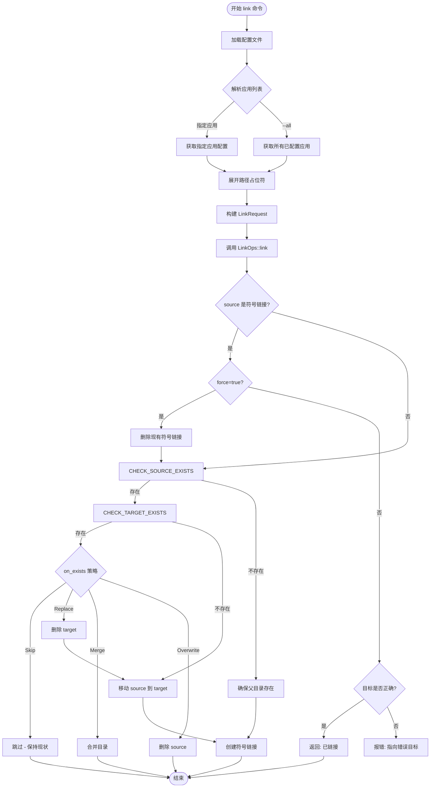
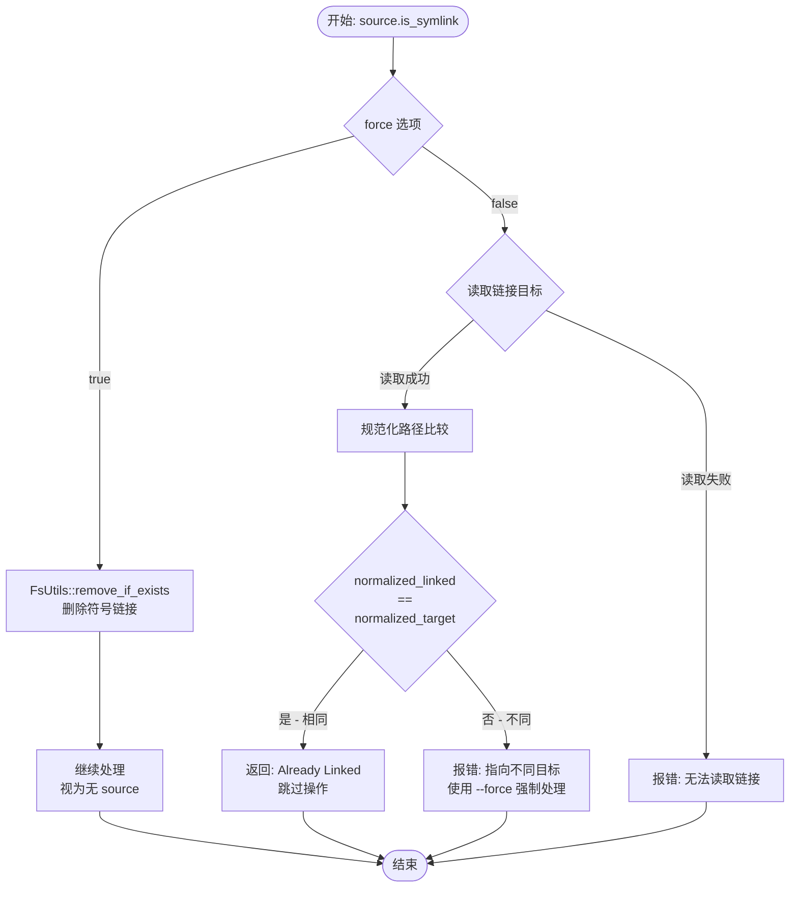
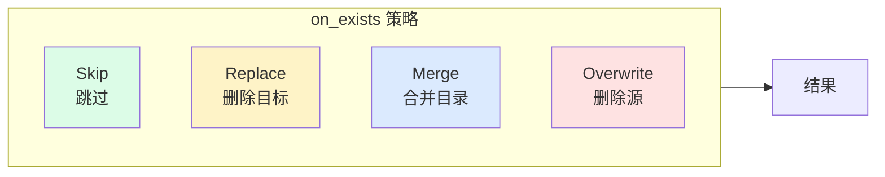
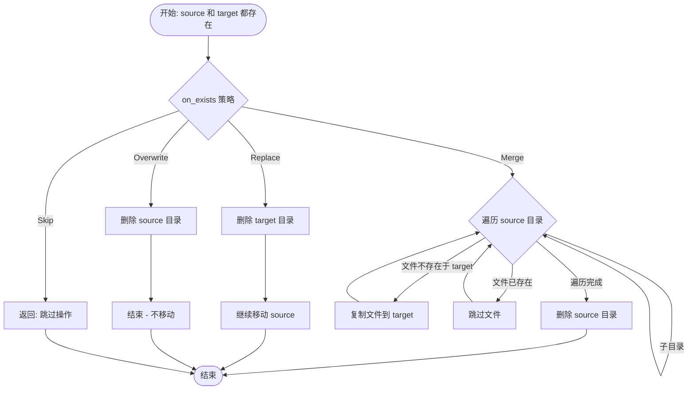
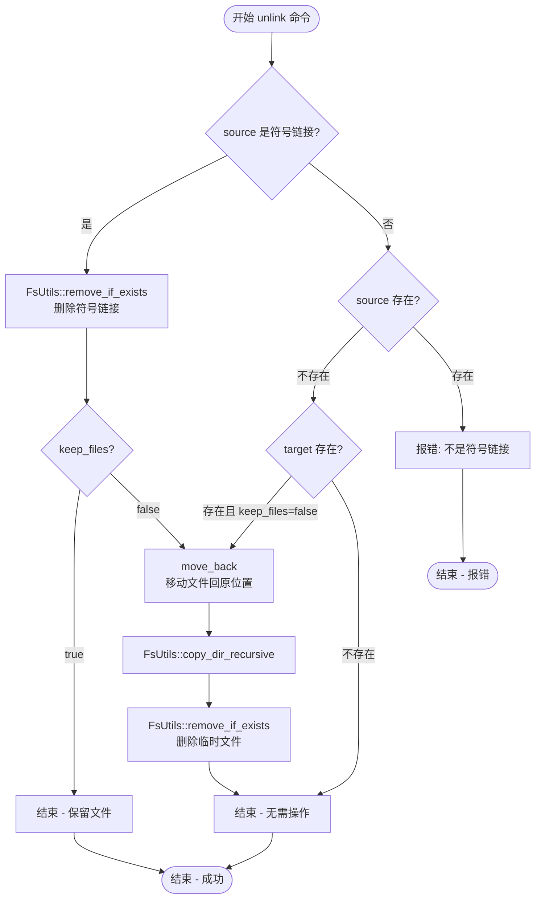
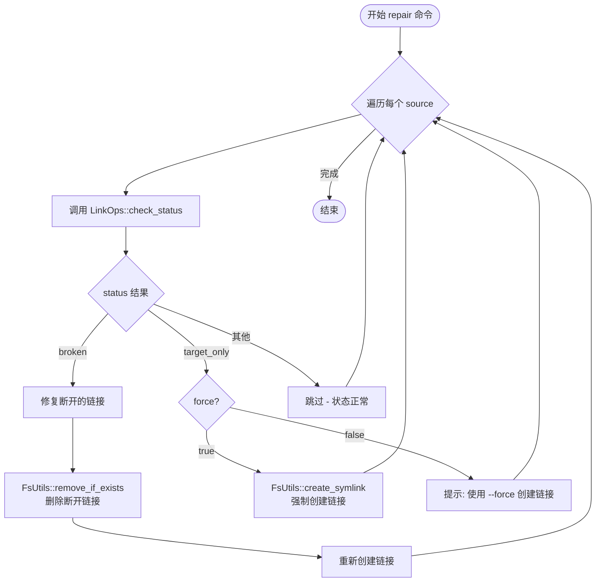
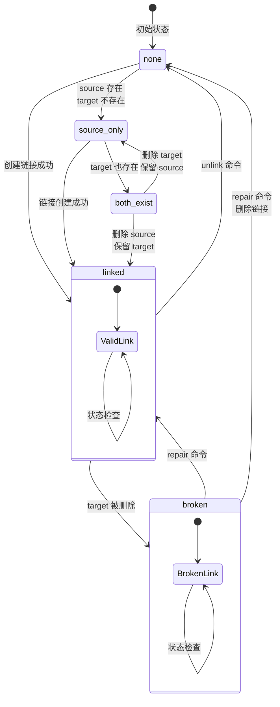

# link-disk 业务流程文档

## 文档说明

本文档详细描述了 `link-disk` 工具的各种业务流程和使用场景，包含完整的流程图和详细说明。

---

## 1. link 命令主流程

### 场景描述

当用户执行 `link-disk link` 命令时，系统会将应用的配置和数据文件夹从原始位置转移到工作区，并在原位置创建符号链接。

### 流程图



**图 1.1: link 命令主流程**

### 流程说明

1. **配置加载阶段**: 系统首先加载 TOML 配置文件，获取工作区路径和应用配置
2. **应用解析阶段**: 根据用户输入确定要处理的应用列表（指定应用或所有应用）
3. **路径展开阶段**: 将配置文件中的占位符（如 `<home>`、`<localappdata>`）替换为实际路径
4. **链接请求构建**: 根据配置创建 `LinkRequest` 对象，包含源路径、目标路径、链接类型和冲突策略
5. **符号链接检查**: 检查源位置是否已经是符号链接
   - 如果是且 `force` 为 true：删除现有链接重新创建
   - 如果是且 `force` 为 false：检查链接目标是否正确，正确则跳过，错误则报错
6. **源文件检查**: 判断源文件/目录是否存在
7. **目标位置检查**: 根据 `on_exists` 策略处理冲突
   - **Skip**: 跳过操作，保持现状
   - **Replace**: 删除目标位置的文件，然后移动源文件
   - **Merge**: 合并两个目录的内容
   - **Overwrite**: 删除源文件，不执行移动
8. **执行移动和链接**: 将源文件移动到目标位置，然后在源位置创建符号链接

---

## 2. 符号链接检查流程 (force 逻辑)

### 场景描述

当源位置已经存在符号链接时，系统需要根据 `force` 选项决定如何处理。

### 流程图



**图 2.1: 符号链接检查与 force 处理流程**

### 流程说明

1. **force 为 true**: 直接删除现有符号链接，继续后续处理（视为源位置为空）
2. **force 为 false**: 
   - 尝试读取符号链接的目标路径
   - 如果读取失败：报错退出
   - 如果读取成功：规范化路径并比较
     - 路径相同：返回"已链接"，跳过操作
     - 路径不同：报错提示用户使用 `--force` 强制处理

---

## 3. on_exists 策略处理流程

### 场景描述

当源位置和目标位置都存在文件时，系统根据配置的 `on_exists` 策略决定如何处理冲突。

### 策略概览



**图 3.1: on_exists 策略概览**

### 详细处理流程



**图 3.2: on_exists 策略详细处理流程**

### 策略说明

| 策略 | 行为 | 适用场景 |
|------|------|---------|
| **Skip** | 不执行任何操作，保持现状 | 不确定是否要覆盖，希望手动处理 |
| **Replace** | 删除目标位置的整个目录，然后将源文件移动过去 | 确保使用最新配置，不需要保留旧配置 |
| **Merge** | 遍历源目录，逐个复制文件到目标目录（不覆盖已存在的文件） | 希望合并新旧配置，保留两边的数据 |
| **Overwrite** | 删除源目录，不执行移动操作 | 希望保留目标位置的配置，丢弃源配置 |

---

## 4. unlink 命令执行流程

### 场景描述

当用户执行 `link-disk unlink` 命令时，系统会删除符号链接，并根据 `keep_files` 选项决定是否将文件移回原位置。

### 流程图



**图 4.1: unlink 命令执行流程**

### 流程说明

1. **符号链接检查**: 检查源位置是否为符号链接
   - 如果是：删除符号链接
   - 如果不是：检查源位置是否存在文件
     - 存在：报错（期望是符号链接但不是）
     - 不存在：继续检查目标位置
2. **keep_files 选项处理**:
   - **true**: 保留目标位置的文件，仅删除符号链接
   - **false**: 将目标位置的文件复制回源位置，然后删除目标位置的临时文件
3. **目标位置检查**: 如果源位置不存在符号链接，检查目标位置是否有文件需要移回

---

## 5. repair 命令执行流程

### 场景描述

当用户执行 `link-disk repair` 命令时，系统会检查所有链接的状态，修复断开的链接或根据 `force` 选项重新创建链接。

### 流程图



**图 5.1: repair 命令执行流程**

### 流程说明

1. **遍历检查**: 对配置的每个 source 位置调用 `LinkOps::check_status` 检查状态
2. **状态处理**:
   - **broken**: 链接存在但目标不存在
     - 删除断开的符号链接
     - 重新创建新的符号链接
   - **target_only**: 只有目标存在（源位置没有链接）
     - `force` 为 true：强制创建符号链接
     - `force` 为 false：提示用户使用 `--force` 选项
   - **其他状态**: 跳过，认为状态正常
3. **完成**: 所有 source 处理完毕后结束

---

## 6. 链接状态流转图

### 场景描述

本文档展示了链接在不同操作下的状态转换过程，帮助理解各种操作对链接状态的影响。

### 状态流转图



**图 6.1: 链接状态流转图**

### 状态说明

| 状态 | 说明 | 触发条件 |
|------|------|---------|
| **none** | 初始状态，源和目标都不存在 | 未进行任何操作 |
| **source_only** | 只有源位置存在文件 | 文件尚未被转移 |
| **linked** | 链接正常，源是符号链接，目标是实际文件 | link 命令成功执行 |
| **broken** | 链接存在但目标文件被删除 | 手动删除了目标文件 |
| **both_exist** | 源和目标都存在（源不是链接） | 配置文件错误或操作中断 |
| **target_only** | 只有目标位置存在文件 | 源位置的链接被删除 |

### 状态转换说明

1. **创建链接** (`none` → `linked` 或 `source_only` → `linked`): 执行 `link` 命令
2. **删除链接** (`linked` → `none`): 执行 `unlink` 命令
3. **链接断开** (`linked` → `broken`): 用户手动删除了目标文件
4. **修复链接** (`broken` → `linked`): 执行 `repair` 命令
5. **冲突状态** (`source_only` → `both_exist`): 目标位置意外出现文件

---

## 7. 业务流程总结

### 7.1 主要业务场景

| 场景 | 触发命令 | 核心流程 | 预期结果 |
|------|---------|---------|---------|
| **首次配置应用** | `link-disk init` | 初始化工作区 → 生成配置文件 | 创建 `~/.link-disk` 目录和 `config.toml` |
| **转移应用数据** | `link-disk link <app>` | 加载配置 → 展开路径 → 检查冲突 → 移动文件 → 创建链接 | 源位置变为符号链接，目标位置保存实际文件 |
| **批量转移** | `link-disk link --all` | 遍历所有应用 → 逐个执行 link 流程 | 所有配置的应用完成数据转移 |
| **恢复应用数据** | `link-disk unlink <app>` | 删除链接 → 移回文件（可选） | 源位置恢复为实际文件 |
| **修复断链** | `link-disk repair <app>` | 检查状态 → 删除断链 → 重建链接 | 所有链接恢复正常状态 |
| **查看状态** | `link-disk status` | 遍历配置 → 检查每个链接状态 → 输出报告 | 显示所有链接的当前状态 |

### 7.2 关键决策点

在业务流程中，有几个关键的决策点需要特别注意：

1. **符号链接检查**: 源位置是否已经是符号链接？
   - 是且指向正确目标 → 跳过
   - 是但指向错误目标 → 报错或使用 `--force`
   - 不是 → 继续检查

2. **冲突处理策略**: 当源和目标都存在时如何处理？
   - 由配置文件的 `on_exists` 字段决定
   - 可选择跳过、替换、合并或覆盖

3. **force 选项**: 是否强制处理？
   - `--force`: 强制执行，不询问
   - 默认：保守处理，避免数据丢失

### 7.3 错误处理流程

所有业务流程都遵循统一的错误处理模式：

1. **操作前检查**: 验证路径、权限、依赖
2. **操作中保护**: 先备份再操作，确保可回滚
3. **操作后验证**: 确认操作结果符合预期
4. **错误传播**: 使用 `anyhow::Result` 统一错误类型，通过 `?` 操作符传播

---

## 8. 使用示例

### 8.1 典型使用场景

#### 场景一：转移浏览器数据

```bash
# 1. 初始化工作区
link-disk init --path "D:/link-disk"

# 2. 编辑配置文件，添加 Chrome 应用
# 编辑 ~/.link-disk/config.toml

# 3. 转移 Chrome 数据
link-disk link chrome

# 4. 验证状态
link-disk status chrome
```

#### 场景二：批量转移开发工具配置

```bash
# 1. 配置多个开发工具（VS Code, IntelliJ, Git 等）
# 编辑 config.toml

# 2. 批量转移
link-disk link --all

# 3. 检查所有链接状态
link-disk status
```

#### 场景三：恢复数据到原始位置

```bash
# 1. 删除符号链接，将文件移回原位置
link-disk unlink chrome

# 2. 如果只想删除链接但保留文件在目标位置
link-disk unlink chrome --keep-files
```

### 8.2 故障排除

| 问题 | 可能原因 | 解决方案 |
|------|---------|---------|
| 链接创建失败 | 权限不足 | 使用管理员权限运行 |
| 链接断开 | 目标文件被删除 | 使用 `repair` 命令修复 |
| 冲突错误 | 源和目标都存在 | 使用 `on_exists` 策略或 `--force` |
| 路径解析失败 | 占位符拼写错误 | 检查配置文件中的占位符 |

---

## 9. 配置与流程的关系

### 9.1 配置文件如何影响流程

```toml
[workspace]
path = "D:/link-disk-workspace"

[apps.chrome]
name = "Google Chrome"
enabled = true
on_exists = "merge"  # 影响冲突处理流程

[[apps.chrome.sources]]
source = "<localappdata>/Google/Chrome"
target = "chrome/User Data"
link_type = "symlink"  # 影响链接创建方式
```

- **workspace.path**: 决定目标位置的根目录
- **on_exists**: 决定冲突时的处理策略（skip/merge/replace/overwrite）
- **link_type**: 决定创建符号链接还是硬链接
- **enabled**: 决定是否处理该应用（`--all` 时跳过 disabled 的应用）

### 9.2 命令行参数对流程的影响

| 参数 | 影响的流程 | 作用 |
|------|-----------|------|
| `--config` | 配置加载 | 指定配置文件路径 |
| `--verbose` | 所有流程 | 输出详细日志 |
| `--force` | link/unlink/repair | 强制执行，跳过确认 |
| `--dry-run` | link | 模拟执行，不实际操作 |
| `--keep-files` | unlink | 保留目标位置的文件 |
| `--all` | link/status | 处理所有配置的应用 |
