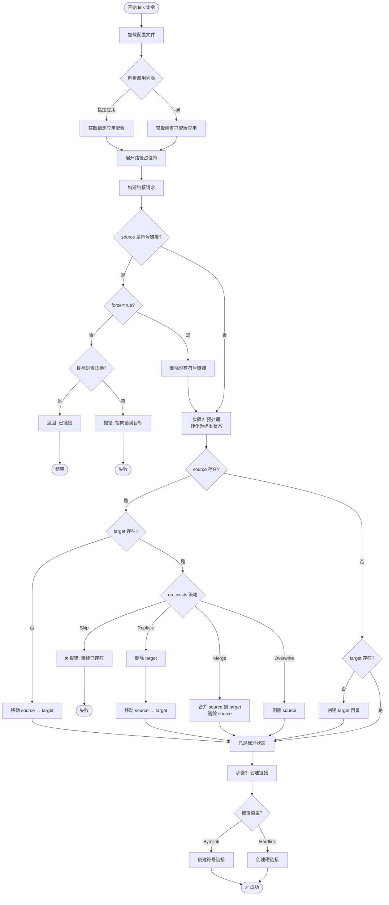
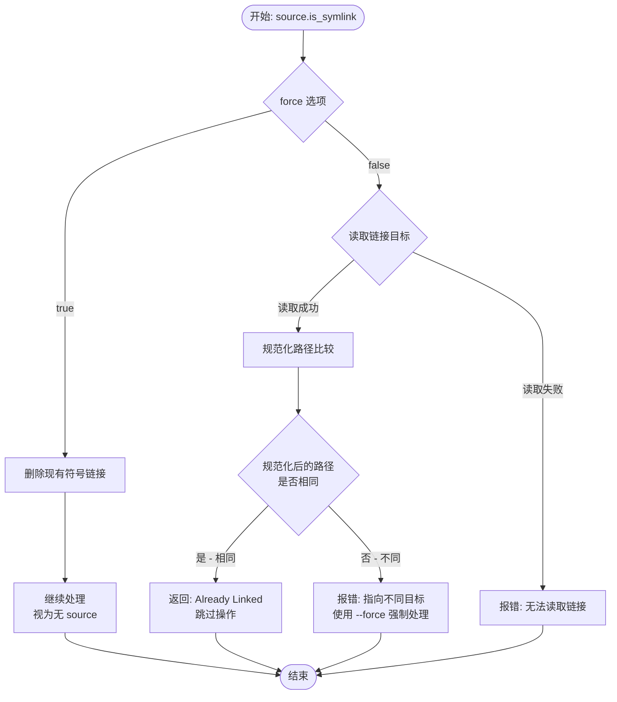
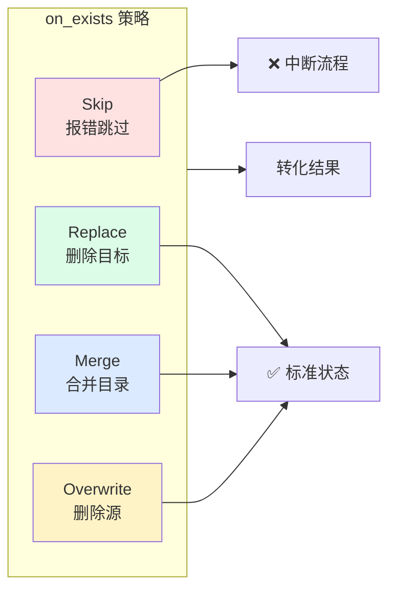
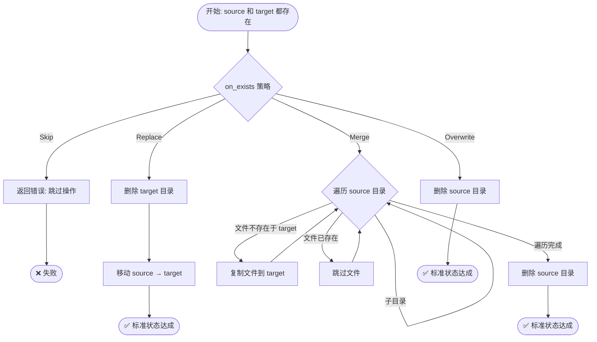
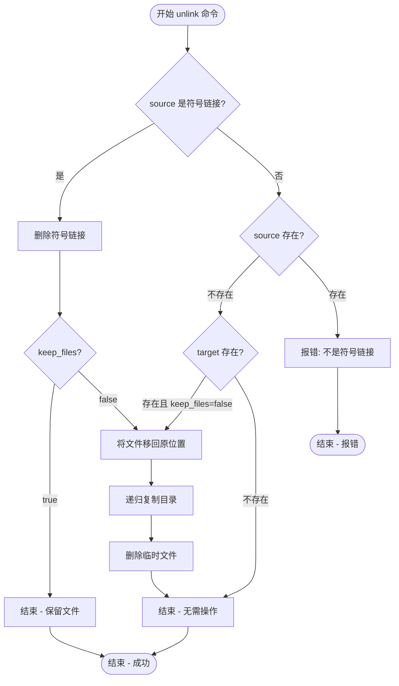
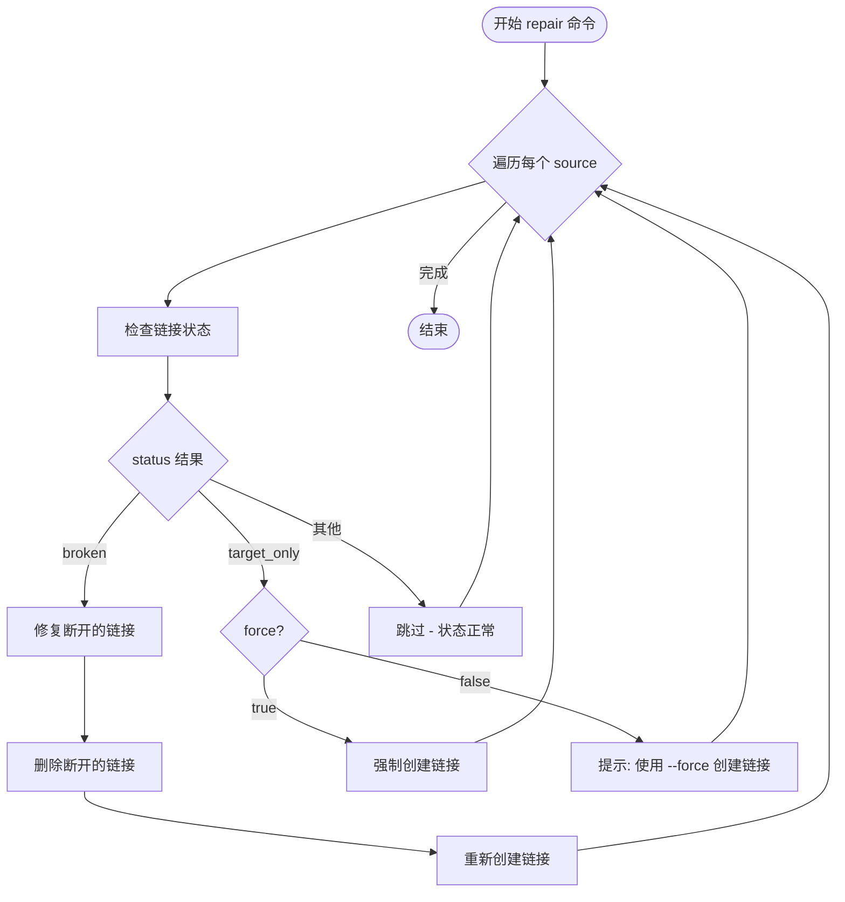
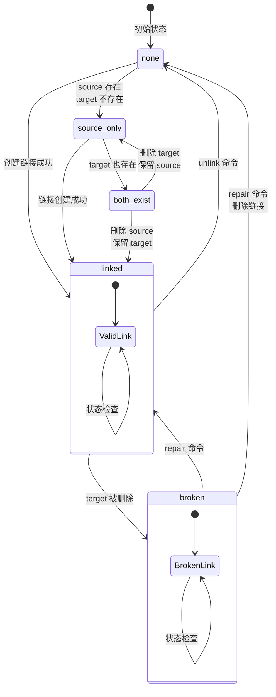

# link-disk 业务流程文档

## 文档说明

本文档详细描述了 `link-disk` 工具的各种业务流程和使用场景，包含完整的流程图和详细说明。

---

## 1. link 命令主流程

### 场景描述

当用户执行 `link-disk link` 命令时，系统会将应用的配置和数据文件夹从原始位置转移到工作区，并在原位置创建符号链接。

### 核心设计思路

所有情况的最终目标都是转化为 **"source 不存在 + target 存在"** 的标准状态，然后直接执行 `create_link(source, target)`。

### 流程图


```mermaid
flowchart TD
    START([开始 link 命令]) --> LOAD_CONFIG[加载配置文件]
    LOAD_CONFIG --> PARSE_APPS{解析应用列表}
    PARSE_APPS -->|指定应用| GET_APP[获取指定应用配置]
    PARSE_APPS -->|--all| GET_ALL_APPS[获取所有已配置应用]
    GET_APP --> EXPAND_PATHS
    GET_ALL_APPS --> EXPAND_PATHS[展开路径占位符]
    EXPAND_PATHS --> BUILD_REQUEST[构建链接请求]
    BUILD_REQUEST --> CHECK_SYMLINK{source 是符号链接?}
    
    CHECK_SYMLINK -->|是| CHECK_FORCE{force=true?}
    CHECK_FORCE -->|是| REMOVE_SYMLINK[删除现有符号链接]
    REMOVE_SYMLINK --> PREPARE_STANDARD_STATE
    CHECK_FORCE -->|否| CHECK_SYMLINK_TARGET{目标是否正确?}
    CHECK_SYMLINK_TARGET -->|是| ALREADY_LINKED[返回: 已链接]
    ALREADY_LINKED --> END1([结束])
    CHECK_SYMLINK_TARGET -->|否| ERROR_WRONG_TARGET[报错: 指向错误目标]
    ERROR_WRONG_TARGET --> END2([失败])
    
    CHECK_SYMLINK -->|否| PREPARE_STANDARD_STATE[步骤2: 预处理<br/>转化为标准状态]
    
    PREPARE_STANDARD_STATE --> CHECK_SOURCE{source 存在?}
    
    CHECK_SOURCE -->|是| CHECK_TARGET{target 存在?}
    CHECK_TARGET -->|否| MOVE_SOURCE[移动 source → target]
    MOVE_SOURCE --> STANDARD_STATE[标准状态达成]
    
    CHECK_TARGET -->|是| ON_EXISTS_STRATEGY{on_exists 策略}
    ON_EXISTS_STRATEGY -->|Skip| SKIP_ERROR[❌ 报错: 目标已存在]
    SKIP_ERROR --> END3([失败])
    ON_EXISTS_STRATEGY -->|Replace| DELETE_TARGET[删除 target]
    DELETE_TARGET --> MOVE_SOURCE2[移动 source → target]
    MOVE_SOURCE2 --> STANDARD_STATE
    ON_EXISTS_STRATEGY -->|Merge| MERGE_DIRS[合并 source 到 target<br/>删除 source]
    MERGE_DIRS --> STANDARD_STATE
    ON_EXISTS_STRATEGY -->|Overwrite| DELETE_SOURCE[删除 source]
    DELETE_SOURCE --> STANDARD_STATE
    
    CHECK_SOURCE -->|否| ENSURE_TARGET{target 存在?}
    ENSURE_TARGET -->|否| CREATE_TARGET[创建 target 目录]
    CREATE_TARGET --> STANDARD_STATE
    ENSURE_TARGET -->|是| STANDARD_STATE[已是标准状态]
    
    STANDARD_STATE --> CREATE_LINK[步骤3: 创建链接]
    CREATE_LINK --> LINK_TYPE{链接类型?}
    LINK_TYPE -->|Symlink| CREATE_SYMLINK[创建符号链接]
    LINK_TYPE -->|Hardlink| CREATE_HARDLINK[创建硬链接]
    CREATE_SYMLINK --> END4([✅ 成功])
    CREATE_HARDLINK --> END4
```

**图 1.1: link 命令主流程（基于"转化为标准状态"设计模式）**

### 流程说明

#### 步骤 1: 检查符号链接

检查源位置是否已经是符号链接：

- **是 + 指向正确** → 返回"已链接"，结束流程
- **是 + 指向错误 + force=true** → 删除旧链接，继续预处理
- **是 + 指向错误 + force=false** → 报错退出
- **不是** → 继续预处理

#### 步骤 2: 预处理（转化为标准状态）

通过各种手段将当前状态转化为 **"source 不存在 + target 存在"**：

| 当前状态 | 操作 | 转化结果 |
|---------|------|---------|
| source 存在 + target 不存在 | 移动 source → target | source 不存在 + target 存在 |
| source 存在 + target 存在 + Replace | 删除 target → 移动 source → target | source 不存在 + target 存在 |
| source 存在 + target 存在 + Merge | 合并 source 到 target → 删除 source | source 不存在 + target 存在 |
| source 存在 + target 存在 + Overwrite | 删除 source | source 不存在 + target 存在 |
| source 存在 + target 存在 + Skip | 报错退出 | ❌ 失败 |
| source 不存在 + target 不存在 | 创建 target 目录 | source 不存在 + target 存在 |
| source 不存在 + target 存在 | 无需操作（已是标准状态） | source 不存在 + target 存在 |

#### 步骤 3: 创建链接

在 source 位置创建指向 target 的链接：

- **Symlink**: 创建符号链接 `source -> target`
- **Hardlink**: 创建硬链接 `source -> target`

---

## 2. 符号链接检查流程 (force 逻辑)

### 场景描述

当源位置已经存在符号链接时，系统需要根据 `force` 选项决定如何处理。

### 流程图


```mermaid
flowchart TD
    START([开始: source.is_symlink]) --> CHECK_FORCE{force 选项}
    CHECK_FORCE -->|true| REMOVE_LINK[删除现有符号链接]
    CHECK_FORCE -->|false| CHECK_TARGET{读取链接目标}
    REMOVE_LINK --> CONTINUE[继续处理<br/>视为无 source]
    CHECK_TARGET -->|读取成功| NORMALIZE_PATHS[规范化路径比较]
    CHECK_TARGET -->|读取失败| ERROR_READ_LINK[报错: 无法读取链接]
    NORMALIZE_PATHS --> COMPARE{规范化后的路径<br/>是否相同}
    COMPARE -->|是 - 相同| RETURN_LINKED[返回: Already Linked<br/>跳过操作]
    COMPARE -->|否 - 不同| ERROR_DIFFERENT[报错: 指向不同目标<br/>使用 --force 强制处理]
    RETURN_LINKED --> END([结束])
    ERROR_READ_LINK --> END
    ERROR_DIFFERENT --> END
    CONTINUE --> END
```

**图 2.1: 符号链接检查与 force 处理流程**

### 流程说明

1. **force 为 true**: 直接删除现有符号链接，继续后续处理（视为源位置为空）
2. **force 为 false**:
   - 尝试读取符号链接的目标路径
   - 如果读取失败：报错退出
   - 如果读取成功：规范化路径（统一正斜杠、小写）并比较
     - 路径相同：返回"已链接"，跳过操作
     - 路径不同：报错提示用户使用 `--force` 强制处理

---

## 3. on_exists 策略处理流程

### 场景描述

当源位置和目标位置都存在文件时，系统根据配置的 `on_exists` 策略决定如何处理冲突。

### 策略概览


```mermaid
flowchart LR
    subgraph ONEXISTS[on_exists 策略]
        direction TB
        SKIP[Skip<br/>报错跳过]
        REPLACE[Replace<br/>删除目标]
        MERGE[Merge<br/>合并目录]
        OVERWRITE[Overwrite<br/>删除源]
    end
    
    ONEXISTS --> RESULT[转化结果]
    SKIP --> FAIL[❌ 中断流程]
    REPLACE --> SUCCESS[✅ 标准状态]
    MERGE --> SUCCESS
    OVERWRITE --> SUCCESS

    style SKIP fill:#fee2e2
    style REPLACE fill:#dcfce7
    style MERGE fill:#dbeafe
    style OVERWRITE fill:#fef3c7
```

**图 3.1: on_exists 策略概览**

### 详细处理流程


```mermaid
flowchart TD
    START([开始: source 和 target 都存在]) --> CHECK_STRATEGY{on_exists 策略}
    
    CHECK_STRATEGY -->|Skip| RETURN_SKIP[返回错误: 跳过操作]
    RETURN_SKIP --> END1([❌ 失败])
    
    CHECK_STRATEGY -->|Replace| DELETE_TARGET[删除 target 目录]
    DELETE_TARGET --> MOVE_SOURCE[移动 source → target]
    MOVE_SOURCE --> END2([✅ 标准状态达成])
    
    CHECK_STRATEGY -->|Merge| MERGE_LOOP{遍历 source 目录}
    MERGE_LOOP -->|子目录| MERGE_LOOP
    MERGE_LOOP -->|文件不存在于 target| COPY_FILE[复制文件到 target]
    MERGE_LOOP -->|文件已存在| SKIP_FILE[跳过文件]
    MERGE_LOOP -->|遍历完成| DELETE_SOURCE_DIR[删除 source 目录]
    COPY_FILE --> MERGE_LOOP
    SKIP_FILE --> MERGE_LOOP
    DELETE_SOURCE_DIR --> END3([✅ 标准状态达成])
    
    CHECK_STRATEGY -->|Overwrite| DELETE_SOURCE[删除 source 目录]
    DELETE_SOURCE --> END4([✅ 标准状态达成])
```

**图 3.2: on_exists 策略详细处理流程**

### 策略说明

| 策略 | 预处理操作 | 转化结果 | 后续步骤 | 适用场景 |
|------|-----------|---------|---------|---------|
| **Skip** | 不执行任何操作 | 保持现状 | ❌ 报错中断 | 保留 target 的现有数据，避免覆盖 |
| **Replace** | 删除 target → 移动 source → target | source 不存在 + target 存在 | create_link | 确认 target 数据不再需要，完全替换 |
| **Merge** | 合并 source 到 target 后删除 source | source 不存在 + target 存在 | create_link | 以 target 为准，source 补充缺失内容 |
| **Overwrite** | 删除 source | source 不存在 + target 存在 | create_link | 保留 target 数据，丢弃 source 旧数据 |

---

## 4. unlink 命令执行流程

### 场景描述

当用户执行 `link-disk unlink` 命令时，系统会删除符号链接，并根据 `keep_files` 选项决定是否将文件移回原位置。

### 流程图


```mermaid
flowchart TD
    START([开始 unlink 命令]) --> CHECK_SYMLINK{source 是符号链接?}
    CHECK_SYMLINK -->|是| REMOVE_LINK[删除符号链接]
    CHECK_SYMLINK -->|否| CHECK_EXISTS{source 存在?}
    REMOVE_LINK --> CHECK_KEEP_FILES{keep_files?}
    CHECK_KEEP_FILES -->|true| END_SKIP[结束 - 保留文件]
    CHECK_KEEP_FILES -->|false| MOVE_BACK[将文件移回原位置]
    CHECK_EXISTS -->|不存在| CHECK_TARGET{target 存在?}
    CHECK_EXISTS -->|存在| ERROR_NOT_SYMLINK[报错: 不是符号链接]
    CHECK_TARGET -->|存在且 keep_files=false| MOVE_BACK
    CHECK_TARGET -->|不存在| END_OK[结束 - 无需操作]
    MOVE_BACK --> COPY_DIR[递归复制目录]
    COPY_DIR --> REMOVE_SOURCE[删除临时文件]
    REMOVE_SOURCE --> END_OK
    ERROR_NOT_SYMLINK --> END_ERROR([结束 - 报错])
    END_OK --> END_SUCCESS([结束 - 成功])
    END_SKIP --> END_SUCCESS
```

**图 4.1: unlink 命令执行流程**

### 流程说明

1. **符号链接检查**: 检查源位置是否为符号链接
   - 如果是：删除符号链接，然后根据 `keep_files` 选项处理
     - `keep_files` 为 false：将目标位置的文件移回源位置
     - `keep_files` 为 true：保留目标位置的文件
   - 如果不是：检查源位置是否存在文件
     - 存在：报错（期望是符号链接但不是）
     - 不存在：检查目标位置是否有文件
       - 有文件且 `keep_files` 为 false：将文件移回源位置
       - 其他情况：无需操作
2. **移回文件逻辑**:
   - 如果目标是目录：递归复制到源位置，然后删除目标目录
   - 如果目标是文件：直接重命名到源位置

---

## 5. repair 命令执行流程

### 场景描述

当用户执行 `link-disk repair` 命令时，系统会检查所有链接的状态，修复断开的链接或根据 `force` 选项重新创建链接。

### 流程图


```mermaid
flowchart TD
    START([开始 repair 命令]) --> FOR_EACH_SOURCE{遍历每个 source}
    FOR_EACH_SOURCE --> CHECK_STATUS[检查链接状态]
    CHECK_STATUS --> GET_STATUS{status 结果}
    GET_STATUS -->|broken| REPAIR_BROKEN[修复断开的链接]
    GET_STATUS -->|target_only| CHECK_FORCE{force?}
    GET_STATUS -->|其他| SKIP_STATUS[跳过 - 状态正常]
    REPAIR_BROKEN --> REMOVE_BROKEN_LINK[删除断开的链接]
    REMOVE_BROKEN_LINK --> REPAIR_LINK[重新创建链接]
    REPAIR_LINK --> FOR_EACH_SOURCE
    CHECK_FORCE -->|true| CREATE_LINK_FORCE[强制创建链接]
    CHECK_FORCE -->|false| PRINT_FORCE_HINT[提示: 使用 --force 创建链接]
    CREATE_LINK_FORCE --> FOR_EACH_SOURCE
    PRINT_FORCE_HINT --> FOR_EACH_SOURCE
    SKIP_STATUS --> FOR_EACH_SOURCE
    FOR_EACH_SOURCE -->|完成| END([结束])
```

**图 5.1: repair 命令执行流程**

### 流程说明

1. **遍历检查**: 对配置的每个 source 位置检查状态
2. **状态处理**:
   - **broken**: 链接存在但目标不存在
     - 删除断开的符号链接
     - 重新创建新的符号链接（使用 force 模式）
   - **target_only**: 只有目标存在（源位置没有链接）
     - `force` 为 true：强制创建符号链接
     - `force` 为 false：提示用户使用 `--force` 选项
   - **其他状态**: 跳过，认为状态正常
3. **完成**: 所有 source 处理完毕后结束

---

## 6. 链接状态流转图

### 场景描述

本文档展示了链接在不同操作下的状态转换过程，帮助理解各种操作对链接状态的影响。

### 状态流转图


```mermaid
stateDiagram-v2
    [*] --> none: 初始状态
    none --> source_only: source 存在<br/>target 不存在
    none --> linked: 创建链接成功
    source_only --> linked: 链接创建成功
    linked --> broken: target 被删除
    broken --> linked: repair 命令
    source_only --> both_exist: target 也存在
    both_exist --> linked: 删除 source<br/>保留 target
    both_exist --> source_only: 删除 target<br/>保留 source
    linked --> none: unlink 命令
    broken --> none: repair 命令<br/>删除链接
    state linked {
        [*] --> ValidLink
        ValidLink --> ValidLink: 状态检查
    }
    state broken {
        [*] --> BrokenLink
        BrokenLink --> BrokenLink: 状态检查
    }
```

**图 6.1: 链接状态流转图**

### 状态说明

| 状态 | 说明 | 触发条件 |
|------|------|---------|
| **none** | 初始状态，源和目标都不存在 | 未进行任何操作 |
| **source_only** | 只有源位置存在文件 | 文件尚未被转移 |
| **linked** | 链接正常，源是符号链接，目标是实际文件 | link 命令成功执行 |
| **broken** | 链接存在但目标文件被删除 | 手动删除了目标文件 |
| **both_exist** | 源和目标都存在（源不是链接） | 配置文件错误或操作中断 |
| **target_only** | 只有目标位置存在文件 | 源位置的链接被删除 |

### 状态转换说明

1. **创建链接** (`none` → `linked` 或 `source_only` → `linked`): 执行 `link` 命令
2. **删除链接** (`linked` → `none`): 执行 `unlink` 命令
3. **链接断开** (`linked` → `broken`): 用户手动删除了目标文件
4. **修复链接** (`broken` → `linked`): 执行 `repair` 命令
5. **冲突状态** (`source_only` → `both_exist`): 目标位置意外出现文件

---

## 7. 业务流程总结

### 7.1 主要业务场景

| 场景 | 触发命令 | 核心流程 | 预期结果 |
|------|---------|---------|---------|
| **首次配置应用** | `link-disk init` | 初始化工作区 → 生成配置文件 | 创建 `~/.link-disk` 目录和 `config.toml` |
| **转移应用数据** | `link-disk link <app>` | 预处理转化为标准状态 → 创建链接 | 源位置变为符号链接，目标位置保存实际文件 |
| **批量转移** | `link-disk link --all` | 遍历所有应用 → 逐个执行 link 流程 | 所有配置的应用完成数据转移 |
| **恢复应用数据** | `link-disk unlink <app>` | 删除链接 → 移回文件（可选） | 源位置恢复为实际文件 |
| **修复断链** | `link-disk repair <app>` | 检查状态 → 删除断链 → 重建链接 | 所有链接恢复正常状态 |
| **查看状态** | `link-disk status` | 遍历配置 → 检查每个链接状态 → 输出报告 | 显示所有链接的当前状态 |

### 7.2 关键决策点

在业务流程中，有几个关键的决策点需要特别注意：

1. **符号链接检查**: 源位置是否已经是符号链接？
   - 是且指向正确目标 → 跳过
   - 是但指向错误目标 → 报错或使用 `--force`
   - 不是 → 继续检查

2. **冲突处理策略**: 当源和目标都存在时如何处理？
   - 由配置文件的 `on_exists` 字段决定
   - 可选择跳过、替换、合并或覆盖

3. **force 选项**: 是否强制处理？
   - `--force`: 强制执行，不询问
   - 默认：保守处理，避免数据丢失

### 7.3 错误处理流程

所有业务流程都遵循统一的错误处理模式：

1. **操作前检查**: 验证路径、权限、依赖
2. **操作中保护**: 先备份再操作，确保可回滚
3. **操作后验证**: 确认操作结果符合预期
4. **错误传播**: 统一错误类型，通过错误链传播上下文信息

---

## 8. 使用示例

### 8.1 典型使用场景

#### 场景一：转移浏览器数据

```bash
# 1. 初始化工作区
link-disk init --path "D:/link-disk"

# 2. 编辑配置文件，添加 Chrome 应用
# 编辑 ~/.link-disk/config.toml

# 3. 转移 Chrome 数据
link-disk link chrome

# 4. 验证状态
link-disk status chrome
```

#### 场景二：批量转移开发工具配置

```bash
# 1. 配置多个开发工具（VS Code, IntelliJ, Git 等）
# 编辑 config.toml

# 2. 批量转移
link-disk link --all

# 3. 检查所有链接状态
link-disk status
```

#### 场景三：恢复数据到原始位置

```bash
# 1. 删除符号链接，将文件移回原位置
link-disk unlink chrome

# 2. 如果只想删除链接但保留文件在目标位置
link-disk unlink chrome --keep-files
```

### 8.2 故障排除

| 问题 | 可能原因 | 解决方案 |
|------|---------|---------|
| 链接创建失败 | 权限不足 | 使用管理员权限运行 |
| 链接断开 | 目标文件被删除 | 使用 `repair` 命令修复 |
| 冲突错误 | 源和目标都存在 | 使用 `on_exists` 策略或 `--force` |
| 路径解析失败 | 占位符拼写错误 | 检查配置文件中的占位符 |

---

## 9. 配置与流程的关系

### 9.1 配置文件如何影响流程

```toml
[workspace]
path = "D:/link-disk-workspace"

[apps.chrome]
name = "Google Chrome"
enabled = true
on_exists = "merge"  # 影响冲突处理流程

[[apps.chrome.sources]]
source = "<localappdata>/Google/Chrome"
target = "chrome/User Data"
link_type = "symlink"  # 影响链接创建方式
```

- **workspace.path**: 决定目标位置的根目录
- **on_exists**: 决定冲突时的处理策略（skip/merge/replace/overwrite）
- **link_type**: 决定创建符号链接还是硬链接
- **enabled**: 决定是否处理该应用（`--all` 时跳过 disabled 的应用）

### 9.2 命令行参数对流程的影响

| 参数 | 影响的流程 | 作用 |
|------|-----------|------|
| `--config` | 配置加载 | 指定配置文件路径 |
| `--verbose` | 所有流程 | 输出详细日志 |
| `--force` | link/unlink/repair | link: 强制删除已有软链接后重新链接; unlink: 确认执行; repair: 为孤立目标创建链接 |
| `--dry-run` | link | 模拟执行，不实际操作 |
| `--keep-files` | unlink | 保留目标位置的文件 |
| `--all` | link/status/unlink/repair | 处理所有已配置的应用
